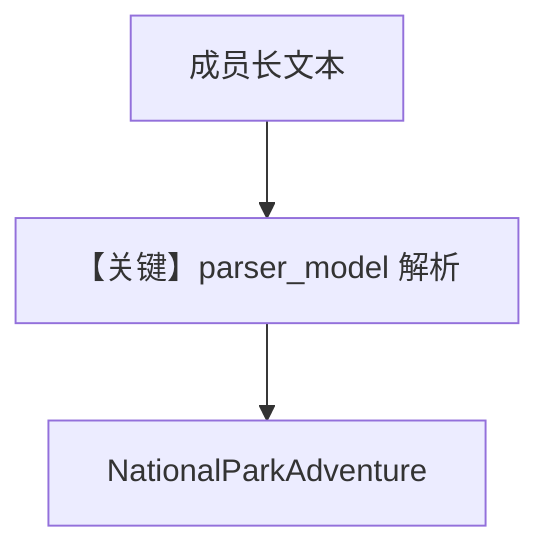

# parser_model.py — 实现原理分析

> 源文件：`cookbook/03_teams/04_structured_input_output/parser_model.py`

## 概述

**parser_model**（`team.py` L271）：当成员生成自由文本后，用 **独立模型** 将内容 **解析** 为 `output_schema`（`NationalParkAdventure`）；队长 `gpt-5-mini`，parser 同为 `gpt-5-mini`。

**核心配置一览：**

| 配置项 | 值 |
|--------|-----|
| `output_schema` | `NationalParkAdventure` |
| `parser_model` | `OpenAIResponses(id="gpt-5-mini")` |

## Mermaid 流程图

```mermaid
flowchart TD
    T["成员长文本"] --> P["【关键】parser_model 解析"]
    P --> S["NationalParkAdventure"]
```

- **【关键】parser_model 解析**：后处理结构化，非原生 JSON mode。

## 关键源码文件索引

| 文件 | 作用 |
|------|------|
| `agno/team/team.py` | L271-273 |
