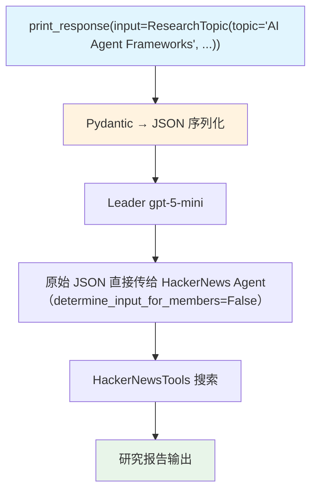

# pydantic_input.py — 实现原理分析

> 源文件：`cookbook/03_teams/04_structured_input_output/pydantic_input.py`

## 概述

本示例展示 Agno Team 的 **Pydantic 模型作为结构化输入**：将 `ResearchTopic` Pydantic 对象直接传入 `team.print_response(input=...)` 而非字符串。框架自动将 Pydantic 对象序列化为 JSON 字符串，使 LLM 能够理解结构化的研究需求，比自然语言描述更精确。

**核心配置一览：**

| 配置项 | 值 | 说明 |
|--------|------|------|
| `name` | `"Hackernews Research Team"` | Team 名称 |
| `model` | `OpenAIResponses(id="gpt-5-mini")` | Leader |
| `determine_input_for_members` | `False` | 原始输入直接传给成员 |
| `members` | `[hackernews_agent]` | HackerNews 搜索成员 |

## 核心组件解析

### Pydantic 输入模型

```python
class ResearchTopic(BaseModel):
    topic: str
    focus_areas: List[str]
    target_audience: str
    sources_required: int = 5
```

调用时传入实例：

```python
team.print_response(input=ResearchTopic(
    topic="AI Agent Frameworks",
    focus_areas=["AI Agents", "Framework Design"],
    target_audience="Software Developers",
    sources_required=7,
))
```

### `determine_input_for_members=False` 的配合

默认情况下，Leader 会重写任务再传给成员。`False` 时原始结构化输入直接传给成员，确保成员也能完整接收 Pydantic 字段，而不是 Leader 重述后可能丢失细节的自然语言版本。

## Mermaid 流程图



## 关键源码文件索引

| 文件 | 关键函数/类 | 作用 |
|------|------------|------|
| `agno/team/team.py` | `determine_input_for_members` | 控制成员收到的输入内容 |
