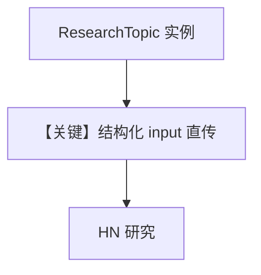

# pydantic_input.py — 实现原理分析

<!-- cookbook-py-source:start -->
## 完整源码

```python
"""
Pydantic Input
==============

Demonstrates passing validated Pydantic models as team inputs.
"""

from typing import List

from agno.agent import Agent
from agno.models.openai import OpenAIResponses
from agno.team import Team
from agno.tools.hackernews import HackerNewsTools
from pydantic import BaseModel, Field


class ResearchTopic(BaseModel):
    """Structured research topic with specific requirements."""

    topic: str = Field(description="The main research topic")
    focus_areas: List[str] = Field(description="Specific areas to focus on")
    target_audience: str = Field(description="Who this research is for")
    sources_required: int = Field(description="Number of sources needed", default=5)


# ---------------------------------------------------------------------------
# Create Members
# ---------------------------------------------------------------------------
hackernews_agent = Agent(
    name="Hackernews Agent",
    model=OpenAIResponses(id="gpt-5-mini"),
    tools=[HackerNewsTools()],
    role="Extract key insights and content from Hackernews posts",
    instructions=[
        "Search Hacker News for relevant articles and discussions",
        "Extract key insights and summarize findings",
        "Focus on high-quality, well-discussed posts",
    ],
)

# ---------------------------------------------------------------------------
# Create Team
# ---------------------------------------------------------------------------
team = Team(
    name="Hackernews Research Team",
    model=OpenAIResponses(id="gpt-5-mini"),
    members=[hackernews_agent],
    determine_input_for_members=False,
    instructions=[
        "Conduct thorough research based on the structured input",
        "Address all focus areas mentioned in the research topic",
        "Tailor the research to the specified target audience",
        "Provide the requested number of sources",
    ],
    show_members_responses=True,
)

# ---------------------------------------------------------------------------
# Run Team
# ---------------------------------------------------------------------------
if __name__ == "__main__":
    research_request = ResearchTopic(
        topic="AI Agent Frameworks",
        focus_areas=[
            "AI Agents",
            "Framework Design",
            "Developer Tools",
            "Open Source",
        ],
        target_audience="Software Developers and AI Engineers",
        sources_required=7,
    )

    team.print_response(input=research_request)

    alternative_research = ResearchTopic(
        topic="Distributed Systems",
        focus_areas=["Microservices", "Event-Driven Architecture", "Scalability"],
        target_audience="Backend Engineers",
        sources_required=5,
    )

    team.print_response(input=alternative_research)
```

<!-- cookbook-py-source:end -->

> 源文件：`cookbook/03_teams/04_structured_input_output/pydantic_input.py`

## 概述

**Pydantic 对象作为 `input`**：`ResearchTopic` 直接 `print_response(input=research_request)`；`determine_input_for_members=False` 控制成员侧输入形态；成员单 HN Agent。

**核心配置一览：**

| 配置项 | 值 |
|--------|-----|
| `determine_input_for_members` | `False` |

## Mermaid 流程图


```mermaid
flowchart TD
    P["ResearchTopic 实例"] --> R["【关键】结构化 input 直传"]
    R --> M["HN 研究"]
```

- **【关键】结构化 input 直传**：类型化请求体。

## 关键源码文件索引

| 文件 | 作用 |
|------|------|
| `agno/team/team.py` | `determine_input_for_members` L103-106 |
