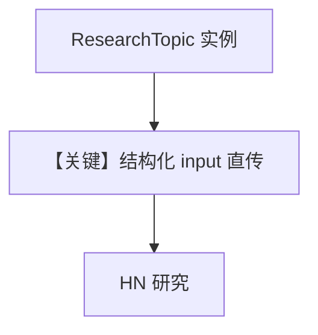

# pydantic_input.py — 实现原理分析

> 源文件：`cookbook/03_teams/04_structured_input_output/pydantic_input.py`

## 概述

**Pydantic 对象作为 `input`**：`ResearchTopic` 直接 `print_response(input=research_request)`；`determine_input_for_members=False` 控制成员侧输入形态；成员单 HN Agent。

**核心配置一览：**

| 配置项 | 值 |
|--------|-----|
| `determine_input_for_members` | `False` |

## Mermaid 流程图

```mermaid
flowchart TD
    P["ResearchTopic 实例"] --> R["【关键】结构化 input 直传"]
    R --> M["HN 研究"]
```

- **【关键】结构化 input 直传**：类型化请求体。

## 关键源码文件索引

| 文件 | 作用 |
|------|------|
| `agno/team/team.py` | `determine_input_for_members` L103-106 |
