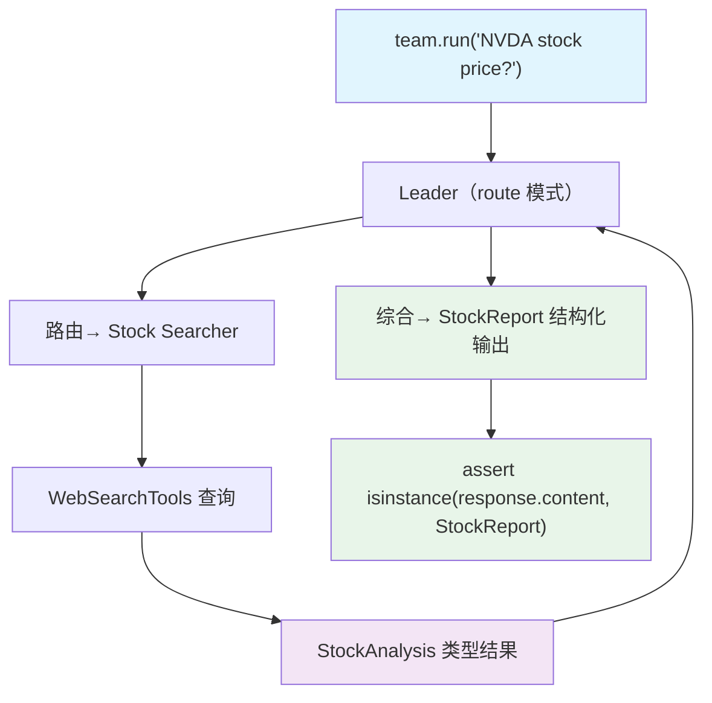

# pydantic_output.py — 实现原理分析

> 源文件：`cookbook/03_teams/04_structured_input_output/pydantic_output.py`

## 概述

本示例展示 Agno Team 的 **Pydantic 多层结构化输出**：成员 Agent 各自持有独立的 `output_schema`（`StockAnalysis`、`CompanyAnalysis`），Team Leader 持有更高层的 `output_schema`（`StockReport`），实现了**成员输出→Leader 综合→最终结构化**的两级 Pydantic 类型约束。

**核心配置一览：**

| 配置项 | 值 | 说明 |
|--------|------|------|
| `name` | `"Stock Research Team"` | Team 名称 |
| `model` | `OpenAIResponses(id="gpt-5.2")` | Leader |
| `mode` | `TeamMode.route` | 路由模式 |
| `output_schema` | `StockReport` | Team 级输出结构 |
| `members` | `[stock_searcher(StockAnalysis), company_info_agent(CompanyAnalysis)]` | 成员各有独立 schema |

## 核心组件解析

### 两级输出 Schema

```python
# 成员级 schema
class StockAnalysis(BaseModel):
    symbol: str
    company_name: str
    analysis: str

# Team 级 schema（Leader 综合输出）
class StockReport(BaseModel):
    symbol: str
    company_name: str
    analysis: str
```

成员被路由时，其 `output_schema` 约束成员自身的 LLM 输出，保证成员返回给 Leader 的数据格式正确。Leader 再将成员结果整合为 `StockReport` 类型。

### 验证方式

```python
response = team.run("What is the current stock price of NVDA?")
assert isinstance(response.content, StockReport)
```

`response.content` 的类型由 Team 的 `output_schema` 决定。

## Mermaid 流程图



## 关键源码文件索引

| 文件 | 关键函数/类 | 作用 |
|------|------------|------|
| `agno/team/team.py` | `output_schema` | Team 级结构化输出约束 |
| `agno/agent/agent.py` | `output_schema` | 成员级结构化输出约束 |
