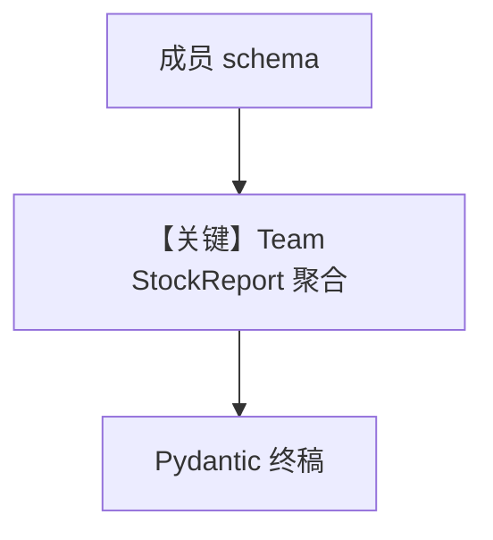

# pydantic_output.py — 实现原理分析

<!-- cookbook-py-source:start -->
## 完整源码

```python
"""
Pydantic Output
===============

Demonstrates team-level typed output using Pydantic schemas.
"""

from agno.agent import Agent
from agno.models.openai import OpenAIResponses
from agno.team import Team, TeamMode
from agno.tools.websearch import WebSearchTools
from agno.utils.pprint import pprint_run_response
from pydantic import BaseModel


class StockAnalysis(BaseModel):
    symbol: str
    company_name: str
    analysis: str


class CompanyAnalysis(BaseModel):
    company_name: str
    analysis: str


class StockReport(BaseModel):
    symbol: str
    company_name: str
    analysis: str


# ---------------------------------------------------------------------------
# Create Members
# ---------------------------------------------------------------------------
stock_searcher = Agent(
    name="Stock Searcher",
    model=OpenAIResponses(id="gpt-5.2"),
    output_schema=StockAnalysis,
    role="Searches for information on stocks and provides price analysis.",
    tools=[WebSearchTools()],
)

company_info_agent = Agent(
    name="Company Info Searcher",
    model=OpenAIResponses(id="gpt-5.2"),
    role="Searches for information about companies and recent news.",
    output_schema=CompanyAnalysis,
    tools=[WebSearchTools()],
)

# ---------------------------------------------------------------------------
# Create Team
# ---------------------------------------------------------------------------
team = Team(
    name="Stock Research Team",
    model=OpenAIResponses(id="gpt-5.2"),
    mode=TeamMode.route,
    members=[stock_searcher, company_info_agent],
    output_schema=StockReport,
    markdown=True,
)

# ---------------------------------------------------------------------------
# Run Team
# ---------------------------------------------------------------------------
if __name__ == "__main__":
    response = team.run("What is the current stock price of NVDA?")
    assert isinstance(response.content, StockReport)
    pprint_run_response(response)
```

<!-- cookbook-py-source:end -->

> 源文件：`cookbook/03_teams/04_structured_input_output/pydantic_output.py`

## 概述

**Team + 成员多层 output_schema**：成员各自 `StockAnalysis` / `CompanyAnalysis`，Team 层 **`StockReport`** 聚合；`TeamMode.route`；最终 `team.run` 得 `StockReport` 实例。

**核心配置一览：**

| 配置项 | 值 |
|--------|-----|
| `mode` | `TeamMode.route` |
| `output_schema` | `StockReport`（Team） |

## Mermaid 流程图


```mermaid
flowchart TD
    A["成员 schema"] --> T["【关键】Team StockReport 聚合"]
    T --> C["Pydantic 终稿"]
```

- **【关键】Team StockReport 聚合**：路由 + 团队级 schema。

## 关键源码文件索引

| 文件 | 作用 |
|------|------|
| `agno/team/team.py` | `output_schema` |
