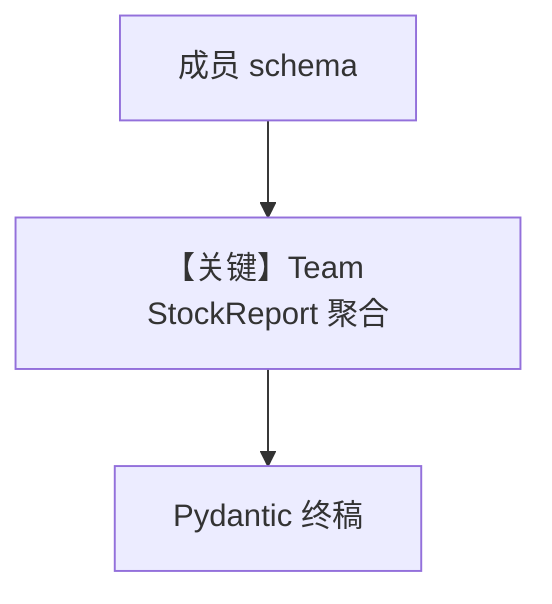

# pydantic_output.py — 实现原理分析

> 源文件：`cookbook/03_teams/04_structured_input_output/pydantic_output.py`

## 概述

**Team + 成员多层 output_schema**：成员各自 `StockAnalysis` / `CompanyAnalysis`，Team 层 **`StockReport`** 聚合；`TeamMode.route`；最终 `team.run` 得 `StockReport` 实例。

**核心配置一览：**

| 配置项 | 值 |
|--------|-----|
| `mode` | `TeamMode.route` |
| `output_schema` | `StockReport`（Team） |

## Mermaid 流程图

```mermaid
flowchart TD
    A["成员 schema"] --> T["【关键】Team StockReport 聚合"]
    T --> C["Pydantic 终稿"]
```

- **【关键】Team StockReport 聚合**：路由 + 团队级 schema。

## 关键源码文件索引

| 文件 | 作用 |
|------|------|
| `agno/team/team.py` | `output_schema` |
