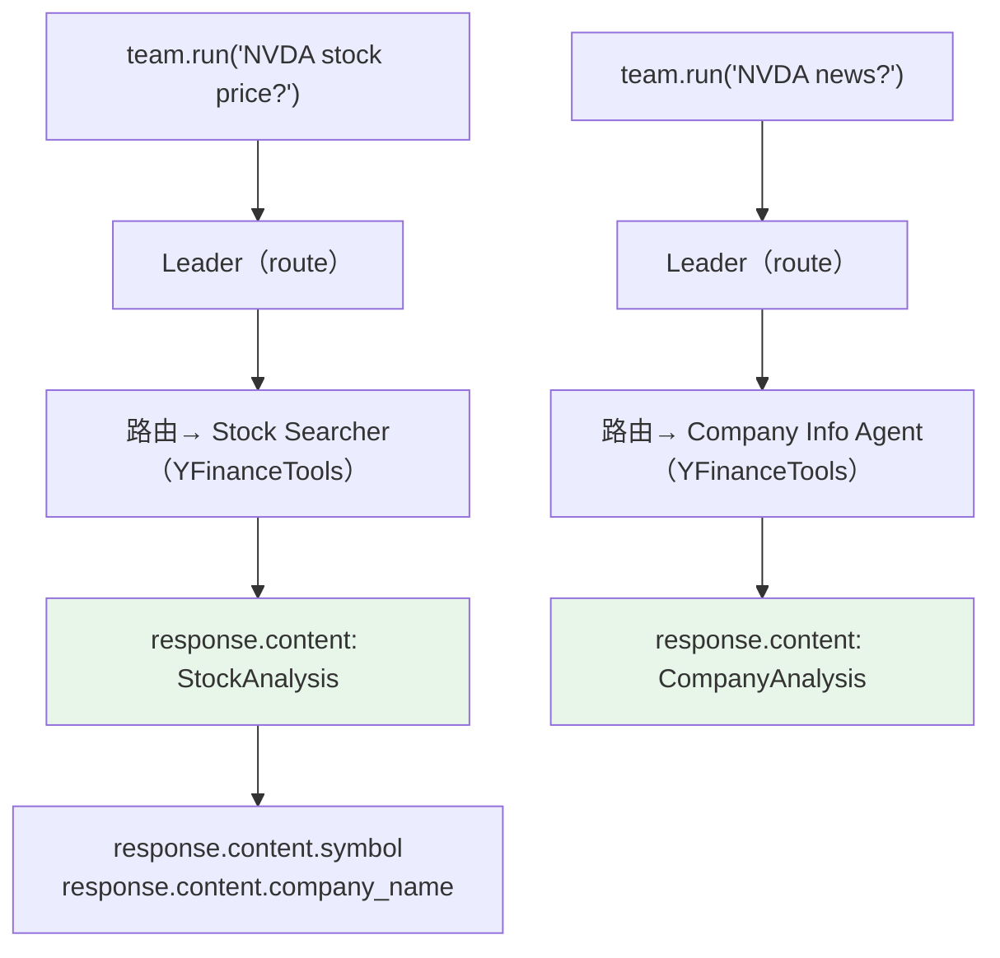

# response_as_variable.py — 实现原理分析

> 源文件：`cookbook/03_teams/04_structured_input_output/response_as_variable.py`

## 概述

本示例展示 Agno Team 的 **结构化响应变量捕获与批量处理**：通过 `team.run()` 返回 `RunResponse` 对象（而非 `print_response` 打印），`response.content` 为强类型 Pydantic 实例，可在下游代码中直接访问字段、进行批量处理。展示了 route 模式下不同成员的 `output_schema` 如何影响 Team 最终返回类型。

**核心配置一览：**

| 配置项 | 值 | 说明 |
|--------|------|------|
| `mode` | `TeamMode.route` | 路由模式（成员输出即 Team 输出） |
| `members` | `[stock_searcher(StockAnalysis), company_info_agent(CompanyAnalysis)]` | 各有独立 schema |
| `show_members_responses` | `True` | 显示成员原始响应 |

## 核心组件解析

### `run()` vs `print_response()`

| 方法 | 返回值 | 适用场景 |
|------|-------|---------|
| `print_response()` | None（直接打印） | 交互式 CLI |
| `run()` | `RunResponse` | 程序化处理、测试 |

### route 模式下的类型传递

在 route 模式中，Leader 路由到某成员后，该成员的输出**直接**作为 Team 的响应。因此：

- 股票价格问题 → Stock Searcher → `response.content: StockAnalysis`
- 公司新闻问题 → Company Info Searcher → `response.content: CompanyAnalysis`

调用方需根据问题类型 `isinstance()` 判断实际类型。

### 批量处理模式

```python
companies = ["AAPL", "GOOGL", "MSFT"]
responses = []
for company in companies:
    response = team.run(f"Analyze {company} stock")
    responses.append(response)
```

Agent 复用（不在循环内创建），符合性能最佳实践。

## Mermaid 流程图



## 关键源码文件索引

| 文件 | 关键函数/类 | 作用 |
|------|------------|------|
| `agno/team/team.py` | `run()` | 返回 RunResponse 的执行方法 |
| `agno/run/response.py` | `RunResponse.content` | 强类型响应内容 |
