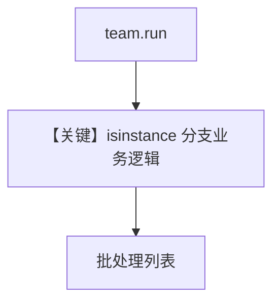

# response_as_variable.py — 实现原理分析

<!-- cookbook-py-source:start -->
## 完整源码

```python
"""
Response As Variable
====================

Demonstrates capturing typed team responses as variables for downstream logic.
"""

from agno.agent import Agent
from agno.models.openai import OpenAIResponses
from agno.team import Team, TeamMode
from agno.tools.yfinance import YFinanceTools
from agno.utils.pprint import pprint_run_response
from pydantic import BaseModel


class StockAnalysis(BaseModel):
    """Stock analysis data structure."""

    symbol: str
    company_name: str
    analysis: str


class CompanyAnalysis(BaseModel):
    """Company analysis data structure."""

    company_name: str
    analysis: str


# ---------------------------------------------------------------------------
# Create Members
# ---------------------------------------------------------------------------
stock_searcher = Agent(
    name="Stock Searcher",
    model=OpenAIResponses(id="gpt-5-mini"),
    output_schema=StockAnalysis,
    role="Searches for stock price and analyst information",
    tools=[
        YFinanceTools(
            enable_stock_price=True,
            enable_analyst_recommendations=True,
        )
    ],
    instructions=[
        "Provide detailed stock analysis with price information",
        "Include analyst recommendations when available",
    ],
)

company_info_agent = Agent(
    name="Company Info Searcher",
    model=OpenAIResponses(id="gpt-5-mini"),
    role="Searches for company news and information",
    output_schema=CompanyAnalysis,
    tools=[
        YFinanceTools(
            enable_stock_price=False,
            enable_company_info=True,
            enable_company_news=True,
        )
    ],
    instructions=[
        "Focus on company news and business information",
        "Provide comprehensive analysis of company developments",
    ],
)

# ---------------------------------------------------------------------------
# Create Team
# ---------------------------------------------------------------------------
team = Team(
    name="Stock Research Team",
    model=OpenAIResponses(id="gpt-5-mini"),
    mode=TeamMode.route,
    members=[stock_searcher, company_info_agent],
    markdown=True,
    show_members_responses=True,
    instructions=[
        "Route stock price questions to the Stock Searcher",
        "Route company news and info questions to the Company Info Searcher",
    ],
)

# ---------------------------------------------------------------------------
# Run Team
# ---------------------------------------------------------------------------
if __name__ == "__main__":
    print("=" * 50)
    print("STOCK PRICE ANALYSIS")
    print("=" * 50)

    stock_response = team.run("What is the current stock price of NVDA?")
    assert isinstance(stock_response.content, StockAnalysis)
    print(f"Response type: {type(stock_response.content)}")
    print(f"Symbol: {stock_response.content.symbol}")
    print(f"Company: {stock_response.content.company_name}")
    print(f"Analysis: {stock_response.content.analysis}")
    pprint_run_response(stock_response)

    print("\n" + "=" * 50)
    print("COMPANY NEWS ANALYSIS")
    print("=" * 50)

    news_response = team.run("What is in the news about NVDA?")
    assert isinstance(news_response.content, CompanyAnalysis)
    print(f"Response type: {type(news_response.content)}")
    print(f"Company: {news_response.content.company_name}")
    print(f"Analysis: {news_response.content.analysis}")
    pprint_run_response(news_response)

    print("\n" + "=" * 50)
    print("BATCH PROCESSING")
    print("=" * 50)

    companies = ["AAPL", "GOOGL", "MSFT"]
    responses = []

    for company in companies:
        response = team.run(f"Analyze {company} stock")
        responses.append(response)
        print(f"Processed {company}: {type(response.content).__name__}")

    print(f"Total responses processed: {len(responses)}")
```

<!-- cookbook-py-source:end -->

> 源文件：`cookbook/03_teams/04_structured_input_output/response_as_variable.py`

## 概述

**类型化 `team.run` 结果下游使用**：`stock_response.content` 为 `StockAnalysis`，`news_response` 为 `CompanyAnalysis`；**批量**循环多 ticker。成员带 **YFinanceTools** 不同开关。

**核心配置一览：**

| 配置项 | 值 |
|--------|-----|
| `mode` | `TeamMode.route` |
| 成员 `output_schema` | 各不同 Pydantic |

## Mermaid 流程图


```mermaid
flowchart TD
    R["team.run"] --> A["【关键】isinstance 分支业务逻辑"]
    A --> B["批处理列表"]
```

- **【关键】isinstance 分支业务逻辑**：把 RunOutput 当强类型变量用。

## 关键源码文件索引

| 文件 | 作用 |
|------|------|
| `agno/team/team.py` | `TeamRunOutput` |
