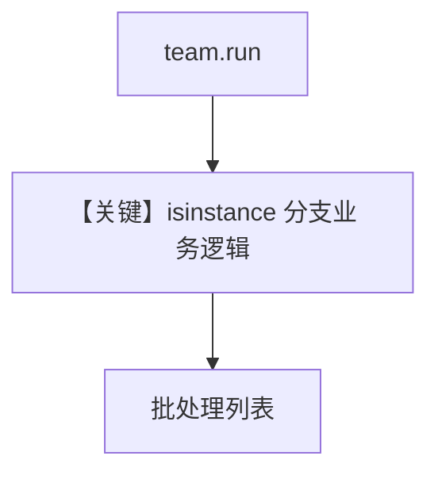

# response_as_variable.py — 实现原理分析

> 源文件：`cookbook/03_teams/04_structured_input_output/response_as_variable.py`

## 概述

**类型化 `team.run` 结果下游使用**：`stock_response.content` 为 `StockAnalysis`，`news_response` 为 `CompanyAnalysis`；**批量**循环多 ticker。成员带 **YFinanceTools** 不同开关。

**核心配置一览：**

| 配置项 | 值 |
|--------|-----|
| `mode` | `TeamMode.route` |
| 成员 `output_schema` | 各不同 Pydantic |

## Mermaid 流程图

```mermaid
flowchart TD
    R["team.run"] --> A["【关键】isinstance 分支业务逻辑"]
    A --> B["批处理列表"]
```

- **【关键】isinstance 分支业务逻辑**：把 RunOutput 当强类型变量用。

## 关键源码文件索引

| 文件 | 作用 |
|------|------|
| `agno/team/team.py` | `TeamRunOutput` |
