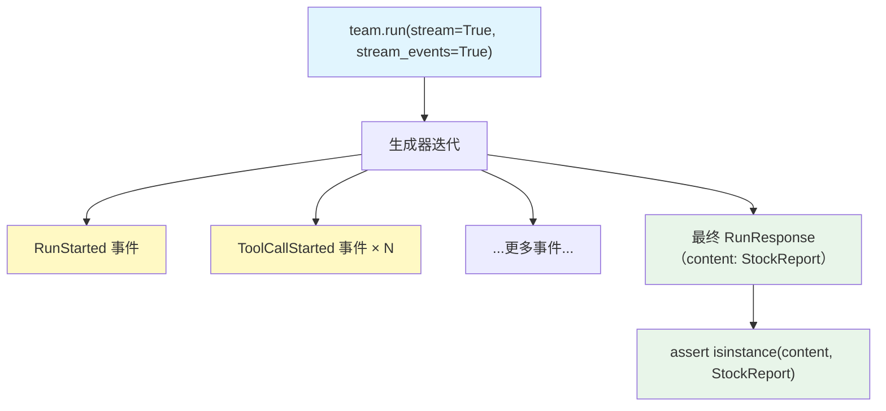

# structured_output_streaming.py — 实现原理分析

> 源文件：`cookbook/03_teams/04_structured_input_output/structured_output_streaming.py`

## 概述

本示例展示 Agno Team 的 **结构化输出 + 流式事件**的组合：`output_schema=StockReport` + `stream=True` + `stream_events=True`，在流式迭代结束后，最后一个 `event_or_response` 是完整的 `StockReport` 类型 `RunResponse`。同时演示了同步和异步两种流式消费方式。

**核心配置一览：**

| 配置项 | 值 | 说明 |
|--------|------|------|
| `output_schema` | `StockReport` | Team 级结构化输出 |
| `stream_events=True` | `True` | 细粒度事件流 |
| `members` | `[stock_searcher(StockAnalysis), company_info_agent(CompanyAnalysis)]` | 各有独立 schema |

## 核心组件解析

### 流式迭代中获取结构化输出

```python
stream_generator = team.run("NVDA stock report", stream=True, stream_events=True)

run_response = None
for event_or_response in stream_generator:
    run_response = event_or_response  # 每次覆盖，最后一个是 RunResponse

assert isinstance(run_response.content, StockReport)
```

流式模式下，生成器产出的元素包括：
- 多个 `RunEvent`（`RunStarted`、`ToolCallStarted` 等事件）
- 最后一个：完整的 `RunResponse`（包含结构化 content）

### 异步流式消费

```python
async for event_or_response in team.arun("...", stream=True, stream_events=True):
    run_response = event_or_response

assert isinstance(run_response.content, StockReport)
```

`apprint_run_response` 工具函数内部处理了此迭代逻辑，简化代码。

## Mermaid 流程图



## 关键源码文件索引

| 文件 | 关键函数/类 | 作用 |
|------|------------|------|
| `agno/team/team.py` | `run(stream=True, stream_events=True)` | 流式结构化输出 |
| `agno/utils/pprint.py` | `apprint_run_response` | 异步响应打印工具 |
