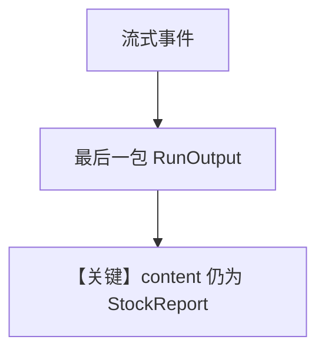

# structured_output_streaming.py — 实现原理分析

<!-- cookbook-py-source:start -->
## 完整源码

```python
"""
Structured Output Streaming
===========================

Demonstrates sync and async streaming with structured team outputs.
"""

import asyncio

from agno.agent import Agent
from agno.models.openai import OpenAIResponses
from agno.team import Team
from agno.tools.yfinance import YFinanceTools
from agno.utils.pprint import apprint_run_response
from pydantic import BaseModel


class StockAnalysis(BaseModel):
    symbol: str
    company_name: str
    analysis: str


class CompanyAnalysis(BaseModel):
    company_name: str
    analysis: str


class StockReport(BaseModel):
    symbol: str
    company_name: str
    analysis: str


# ---------------------------------------------------------------------------
# Create Members
# ---------------------------------------------------------------------------
stock_searcher = Agent(
    name="Stock Searcher",
    model=OpenAIResponses(id="gpt-5-mini"),
    output_schema=StockAnalysis,
    role="Searches the web for information on a stock.",
    tools=[
        YFinanceTools(
            enable_stock_price=True,
            enable_analyst_recommendations=True,
        )
    ],
)

company_info_agent = Agent(
    name="Company Info Searcher",
    model=OpenAIResponses(id="gpt-5-mini"),
    role="Searches the web for information on a stock.",
    output_schema=CompanyAnalysis,
    tools=[
        YFinanceTools(
            enable_stock_price=False,
            enable_company_info=True,
            enable_company_news=True,
        )
    ],
)

# ---------------------------------------------------------------------------
# Create Team
# ---------------------------------------------------------------------------
team = Team(
    name="Stock Research Team",
    model=OpenAIResponses(id="gpt-5-mini"),
    members=[stock_searcher, company_info_agent],
    output_schema=StockReport,
    markdown=True,
    show_members_responses=True,
)


# ---------------------------------------------------------------------------
# Run Team
# ---------------------------------------------------------------------------
async def test_structured_streaming() -> None:
    async_stream = team.arun(
        "Give me a stock report for NVDA",
        stream=True,
        stream_events=True,
    )

    run_response = None
    async for event_or_response in async_stream:
        run_response = event_or_response

    assert isinstance(run_response.content, StockReport)
    print(f"Stock Symbol: {run_response.content.symbol}")
    print(f"Company Name: {run_response.content.company_name}")


async def test_structured_streaming_with_arun() -> None:
    await apprint_run_response(
        team.arun(
            input="Give me a stock report for AAPL",
            stream=True,
            stream_events=True,
        )
    )


if __name__ == "__main__":
    stream_generator = team.run(
        "Give me a stock report for NVDA",
        stream=True,
        stream_events=True,
    )

    run_response = None
    for event_or_response in stream_generator:
        run_response = event_or_response

    assert isinstance(run_response.content, StockReport)
    print(
        f"Response content is correctly typed as StockReport: {type(run_response.content)}"
    )
    print(f"Stock Symbol: {run_response.content.symbol}")
    print(f"Company Name: {run_response.content.company_name}")

    asyncio.run(test_structured_streaming())
    asyncio.run(test_structured_streaming_with_arun())
```

<!-- cookbook-py-source:end -->

> 源文件：`cookbook/03_teams/04_structured_input_output/structured_output_streaming.py`

## 概述

**stream=True + stream_events=True** 下 **仍得 Pydantic 终稿**：迭代结束后 `run_response.content` 为 `StockReport`；含 **async** `arun` 与 `aprint_run_response` 辅助。

**核心配置一览：**

| 配置项 | 值 |
|--------|-----|
| `output_schema` | `StockReport` |
| `stream` / `stream_events` | `True` |

## Mermaid 流程图


```mermaid
flowchart TD
    S["流式事件"] --> L["最后一包 RunOutput"]
    L --> C["【关键】content 仍为 StockReport"]
```

- **【关键】content 仍为 StockReport**：结构化 + 流式不矛盾（终局解析）。

## 关键源码文件索引

| 文件 | 作用 |
|------|------|
| `agno/team/_run.py` | 流式收尾组装 |
