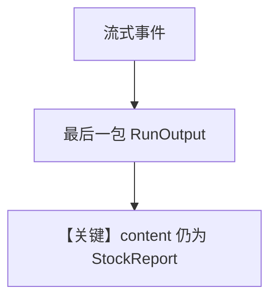

# structured_output_streaming.py — 实现原理分析

> 源文件：`cookbook/03_teams/04_structured_input_output/structured_output_streaming.py`

## 概述

**stream=True + stream_events=True** 下 **仍得 Pydantic 终稿**：迭代结束后 `run_response.content` 为 `StockReport`；含 **async** `arun` 与 `aprint_run_response` 辅助。

**核心配置一览：**

| 配置项 | 值 |
|--------|-----|
| `output_schema` | `StockReport` |
| `stream` / `stream_events` | `True` |

## Mermaid 流程图

```mermaid
flowchart TD
    S["流式事件"] --> L["最后一包 RunOutput"]
    L --> C["【关键】content 仍为 StockReport"]
```

- **【关键】content 仍为 StockReport**：结构化 + 流式不矛盾（终局解析）。

## 关键源码文件索引

| 文件 | 作用 |
|------|------|
| `agno/team/_run.py` | 流式收尾组装 |
