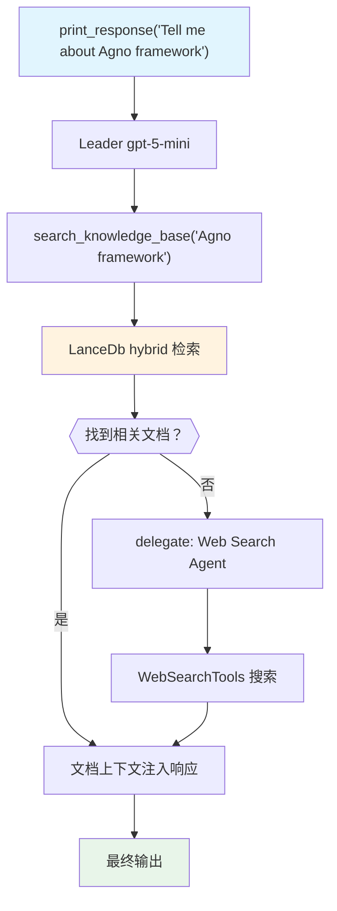

# 01_team_with_knowledge.py — 实现原理分析

> 源文件：`cookbook/03_teams/05_knowledge/01_team_with_knowledge.py`

## 概述

本示例展示 Agno Team 的 **知识库 RAG 集成**：Team Leader 挂载 `Knowledge`（基于 LanceDb + 混合搜索），在回答问题前先从向量数据库检索相关文档，不足时委托 Web Search Agent 进行网络搜索。这是 Team 级别的"本地知识库优先，网络搜索兜底"模式。

**核心配置一览：**

| 配置项 | 值 | 说明 |
|--------|------|------|
| `knowledge` | `agno_docs_knowledge`（LanceDb hybrid） | Team 级知识库 |
| `members` | `[web_agent]`（WebSearchTools） | 网络搜索成员 |
| `model` | `OpenAIResponses(id="gpt-5-mini")` | Leader |

## 核心组件解析

### Knowledge 配置

```python
agno_docs_knowledge = Knowledge(
    vector_db=LanceDb(
        uri=str(tmp_dir.joinpath("lancedb")),
        table_name="agno_docs",
        search_type=SearchType.hybrid,  # 向量+BM25混合检索
        embedder=OpenAIEmbedder(id="text-embedding-3-small"),
    ),
)
agno_docs_knowledge.insert(url="https://docs.agno.com/llms-full.txt")
```

`SearchType.hybrid` 结合向量相似度和关键词 BM25，提升检索召回率。

### Team 级 knowledge 的作用

挂载在 Team 上的 `knowledge` 供 **Leader** 使用（通过 `search_knowledge_base` 工具）。Leader 检索到相关文档后，将上下文注入响应，或传递给成员进一步处理。

成员 Agent 也可以独立持有 `knowledge`（成员级 RAG）。

## Mermaid 流程图



## 关键源码文件索引

| 文件 | 关键函数/类 | 作用 |
|------|------------|------|
| `agno/knowledge/knowledge.py` | `Knowledge` | 知识库抽象 |
| `agno/vectordb/lancedb.py` | `LanceDb`, `SearchType.hybrid` | 向量数据库+混合检索 |
| `agno/team/team.py` | `knowledge` | Team 级知识库挂载 |
