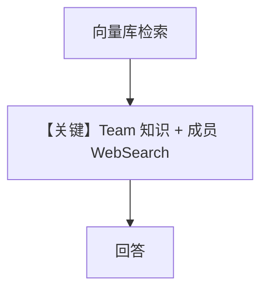

# 01_team_with_knowledge.py — 实现原理分析

<!-- cookbook-py-source:start -->
## 完整源码

```python
"""
Team With Knowledge
=============================

Demonstrates a team that combines knowledge-base retrieval with web search support.
"""

from pathlib import Path

from agno.agent import Agent
from agno.knowledge.embedder.openai import OpenAIEmbedder
from agno.knowledge.knowledge import Knowledge
from agno.models.openai import OpenAIResponses
from agno.team import Team
from agno.tools.websearch import WebSearchTools
from agno.vectordb.lancedb import LanceDb, SearchType

# ---------------------------------------------------------------------------
# Setup
# ---------------------------------------------------------------------------
cwd = Path(__file__).parent
tmp_dir = cwd.joinpath("tmp")
tmp_dir.mkdir(parents=True, exist_ok=True)

agno_docs_knowledge = Knowledge(
    vector_db=LanceDb(
        uri=str(tmp_dir.joinpath("lancedb")),
        table_name="agno_docs",
        search_type=SearchType.hybrid,
        embedder=OpenAIEmbedder(id="text-embedding-3-small"),
    ),
)

agno_docs_knowledge.insert(url="https://docs.agno.com/llms-full.txt")

# ---------------------------------------------------------------------------
# Create Members
# ---------------------------------------------------------------------------
web_agent = Agent(
    name="Web Search Agent",
    role="Handle web search requests",
    model=OpenAIResponses(id="gpt-5-mini"),
    tools=[WebSearchTools()],
    instructions=["Always include sources"],
)

# ---------------------------------------------------------------------------
# Create Team
# ---------------------------------------------------------------------------
team_with_knowledge = Team(
    name="Team with Knowledge",
    members=[web_agent],
    model=OpenAIResponses(id="gpt-5-mini"),
    knowledge=agno_docs_knowledge,
    show_members_responses=True,
    markdown=True,
)

# ---------------------------------------------------------------------------
# Run Team
# ---------------------------------------------------------------------------
if __name__ == "__main__":
    team_with_knowledge.print_response("Tell me about the Agno framework", stream=True)
```

<!-- cookbook-py-source:end -->

> 源文件：`cookbook/03_teams/05_knowledge/01_team_with_knowledge.py`

## 概述

**Team.knowledge**：`Knowledge` + LanceDb 混合检索，插入 `docs.agno.com` 全文；成员 `WebSearchTools` 补网搜；团队级 `knowledge` 与工具检索并存。

**核心配置一览：**

| 配置项 | 值 |
|--------|-----|
| `knowledge` | `agno_docs_knowledge` |
| `search_knowledge` | 默认 True（`team.py` L225） |

## Mermaid 流程图


```mermaid
flowchart TD
    K["向量库检索"] --> T["【关键】Team 知识 + 成员 WebSearch"]
    T --> A["回答"]
```

- **【关键】Team 知识 + 成员 WebSearch**：RAG 与联网互补。

## 关键源码文件索引

| 文件 | 作用 |
|------|------|
| `agno/team/team.py` | L213-227 knowledge 字段 |
| `agno/knowledge/knowledge.py` | `Knowledge` |
