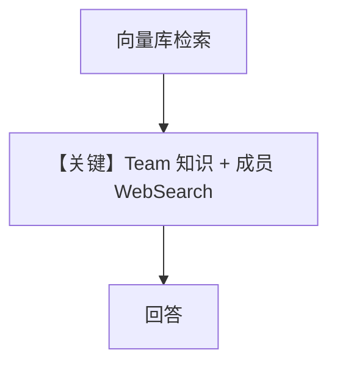

# 01_team_with_knowledge.py — 实现原理分析

> 源文件：`cookbook/03_teams/05_knowledge/01_team_with_knowledge.py`

## 概述

**Team.knowledge**：`Knowledge` + LanceDb 混合检索，插入 `docs.agno.com` 全文；成员 `WebSearchTools` 补网搜；团队级 `knowledge` 与工具检索并存。

**核心配置一览：**

| 配置项 | 值 |
|--------|-----|
| `knowledge` | `agno_docs_knowledge` |
| `search_knowledge` | 默认 True（`team.py` L225） |

## Mermaid 流程图

```mermaid
flowchart TD
    K["向量库检索"] --> T["【关键】Team 知识 + 成员 WebSearch"]
    T --> A["回答"]
```

- **【关键】Team 知识 + 成员 WebSearch**：RAG 与联网互补。

## 关键源码文件索引

| 文件 | 作用 |
|------|------|
| `agno/team/team.py` | L213-227 knowledge 字段 |
| `agno/knowledge/knowledge.py` | `Knowledge` |
