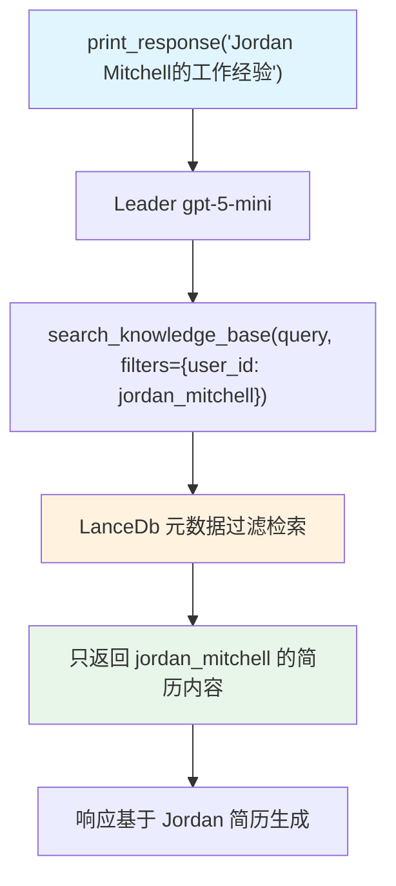

# 02_team_with_knowledge_filters.py — 实现原理分析

> 源文件：`cookbook/03_teams/05_knowledge/02_team_with_knowledge_filters.py`

## 概述

本示例展示 Agno Team 的 **静态 `knowledge_filters` 元数据过滤**：知识库中存储了5份带有 `user_id` 元数据的 PDF 简历，Team 通过 `knowledge_filters={"user_id": "jordan_mitchell"}` 静态过滤，确保检索时只返回 Jordan Mitchell 的文档，即使知识库中存有其他用户的数据。

**核心配置一览：**

| 配置项 | 值 | 说明 |
|--------|------|------|
| `knowledge` | `knowledge_base`（LanceDb） | 共享知识库（5份简历） |
| `knowledge_filters` | `{"user_id": "jordan_mitchell"}` | 静态元数据过滤 |
| `members` | `[web_agent]`（也挂载 knowledge） | 成员也有独立知识库访问 |

## 核心组件解析

### 文档元数据结构

```python
knowledge_base.insert_many([
    {
        "path": downloaded_cv_paths[0],
        "metadata": {
            "user_id": "jordan_mitchell",
            "document_type": "cv",
            "year": 2025,
        },
    },
    # ... 其他4份简历
])
```

向量数据库存储文档时同时存储元数据，检索时可按元数据字段过滤。

### `knowledge_filters` 的作用

```python
knowledge_filters={"user_id": "jordan_mitchell"}
```

所有通过 Team 知识库执行的检索请求都会附加此过滤条件：

```
SQL 等价：WHERE metadata.user_id = 'jordan_mitchell'
```

确保多租户场景下数据隔离，防止用户A看到用户B的数据。

## Mermaid 流程图



## 关键源码文件索引

| 文件 | 关键函数/类 | 作用 |
|------|------------|------|
| `agno/team/team.py` | `knowledge_filters` | 静态元数据过滤配置 |
| `agno/knowledge/knowledge.py` | `insert_many()` | 批量插入含元数据文档 |
