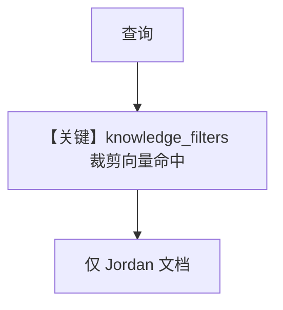

# 02_team_with_knowledge_filters.py — 实现原理分析

> 源文件：`cookbook/03_teams/05_knowledge/02_team_with_knowledge_filters.py`

## 概述

**knowledge_filters** 静态元数据过滤（`team.py` L205）：示例 `{"user_id": "jordan_mitchell"}`，CV PDF 入库时带 `user_id`/`document_type`/`year`。

**核心配置一览：**

| 配置项 | 值 |
|--------|-----|
| `knowledge_filters` | `{"user_id": "jordan_mitchell"}` |

## Mermaid 流程图

```mermaid
flowchart TD
    Q["查询"] --> F["【关键】knowledge_filters 裁剪向量命中"]
    F --> R["仅 Jordan 文档"]
```

- **【关键】knowledge_filters**：静态过滤。

## 关键源码文件索引

| 文件 | 作用 |
|------|------|
| `agno/team/team.py` | L205 |
