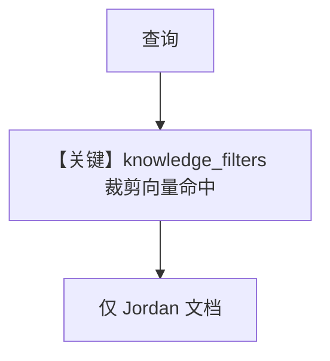

# 02_team_with_knowledge_filters.py — 实现原理分析

<!-- cookbook-py-source:start -->
## 完整源码

```python
"""
Team With Knowledge Filters
===========================

Demonstrates static metadata-based knowledge filtering in team retrieval.
"""

from agno.agent import Agent
from agno.knowledge.knowledge import Knowledge
from agno.knowledge.reader.pdf_reader import PDFReader
from agno.models.openai import OpenAIResponses
from agno.team import Team
from agno.utils.media import (
    SampleDataFileExtension,
    download_knowledge_filters_sample_data,
)
from agno.vectordb.lancedb import LanceDb

# ---------------------------------------------------------------------------
# Setup
# ---------------------------------------------------------------------------
downloaded_cv_paths = download_knowledge_filters_sample_data(
    num_files=5, file_extension=SampleDataFileExtension.PDF
)

vector_db = LanceDb(
    table_name="recipes",
    uri="tmp/lancedb",
)

knowledge_base = Knowledge(
    vector_db=vector_db,
)

knowledge_base.insert_many(
    [
        {
            "path": downloaded_cv_paths[0],
            "metadata": {
                "user_id": "jordan_mitchell",
                "document_type": "cv",
                "year": 2025,
            },
        },
        {
            "path": downloaded_cv_paths[1],
            "metadata": {
                "user_id": "taylor_brooks",
                "document_type": "cv",
                "year": 2025,
            },
        },
        {
            "path": downloaded_cv_paths[2],
            "metadata": {
                "user_id": "morgan_lee",
                "document_type": "cv",
                "year": 2025,
            },
        },
        {
            "path": downloaded_cv_paths[3],
            "metadata": {
                "user_id": "casey_jordan",
                "document_type": "cv",
                "year": 2025,
            },
        },
        {
            "path": downloaded_cv_paths[4],
            "metadata": {
                "user_id": "alex_rivera",
                "document_type": "cv",
                "year": 2025,
            },
        },
    ],
    reader=PDFReader(chunk=True),
)

# ---------------------------------------------------------------------------
# Create Members
# ---------------------------------------------------------------------------
web_agent = Agent(
    name="Knowledge Search Agent",
    role="Handle knowledge search",
    knowledge=knowledge_base,
    model=OpenAIResponses(id="gpt-5-mini"),
)

# ---------------------------------------------------------------------------
# Create Team
# ---------------------------------------------------------------------------
team_with_knowledge = Team(
    name="Team with Knowledge",
    members=[web_agent],
    model=OpenAIResponses(id="gpt-5-mini"),
    knowledge=knowledge_base,
    show_members_responses=True,
    markdown=True,
    knowledge_filters={"user_id": "jordan_mitchell"},
)

# ---------------------------------------------------------------------------
# Run Team
# ---------------------------------------------------------------------------
if __name__ == "__main__":
    team_with_knowledge.print_response(
        "Tell me about Jordan Mitchell's work and experience"
    )
```

<!-- cookbook-py-source:end -->

> 源文件：`cookbook/03_teams/05_knowledge/02_team_with_knowledge_filters.py`

## 概述

**knowledge_filters** 静态元数据过滤（`team.py` L205）：示例 `{"user_id": "jordan_mitchell"}`，CV PDF 入库时带 `user_id`/`document_type`/`year`。

**核心配置一览：**

| 配置项 | 值 |
|--------|-----|
| `knowledge_filters` | `{"user_id": "jordan_mitchell"}` |

## Mermaid 流程图


```mermaid
flowchart TD
    Q["查询"] --> F["【关键】knowledge_filters 裁剪向量命中"]
    F --> R["仅 Jordan 文档"]
```

- **【关键】knowledge_filters**：静态过滤。

## 关键源码文件索引

| 文件 | 作用 |
|------|------|
| `agno/team/team.py` | L205 |
