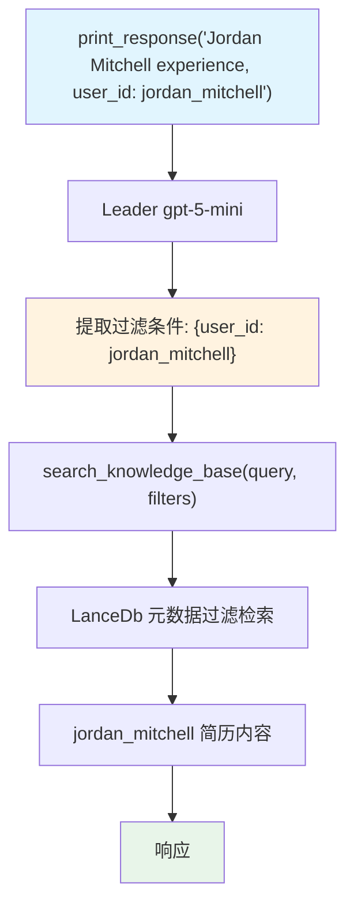

# 03_team_with_agentic_knowledge_filters.py — 实现原理分析

> 源文件：`cookbook/03_teams/05_knowledge/03_team_with_agentic_knowledge_filters.py`

## 概述

本示例展示 Agno Team 的 **`enable_agentic_knowledge_filters` 动态过滤**：与静态 `knowledge_filters` 不同，此模式让 Leader **自主从用户输入中提取过滤条件**（如从"user_id as jordan_mitchell"提取 `{"user_id": "jordan_mitchell"}`），无需调用方硬编码过滤参数。适合过滤条件由用户动态指定的场景。

**核心配置一览：**

| 配置项 | 值 | 说明 |
|--------|------|------|
| `enable_agentic_knowledge_filters` | `True` | 启用动态过滤提取 |
| `knowledge` | `knowledge`（LanceDb，5份简历） | 共享知识库 |
| `members` | `[web_agent]`（`add_knowledge_to_context=True`） | 成员也有知识库 |

## 核心组件解析

### 动态过滤 vs 静态过滤

| 特性 | `knowledge_filters`（静态） | `enable_agentic_knowledge_filters`（动态） |
|------|--------------------------|----------------------------------------|
| 过滤条件来源 | 代码配置 | LLM 从用户输入提取 |
| 灵活性 | 固定 | 按用户意图动态变化 |
| 适用场景 | 已知用户ID/角色 | 用户在消息中指定过滤条件 |

### 工作机制

```
用户: "Tell me about Jordan Mitchell's experience with user_id as jordan_mitchell"
                                              ↑
                              Leader 提取: {"user_id": "jordan_mitchell"}
                                              ↓
                    search_knowledge_base(query, filters={"user_id": "jordan_mitchell"})
```

Leader 将用户消息和知识库元数据 schema 一起分析，提取相关过滤键值。

## Mermaid 流程图



## 关键源码文件索引

| 文件 | 关键函数/类 | 作用 |
|------|------------|------|
| `agno/team/team.py` | `enable_agentic_knowledge_filters` | 动态过滤提取开关 |
