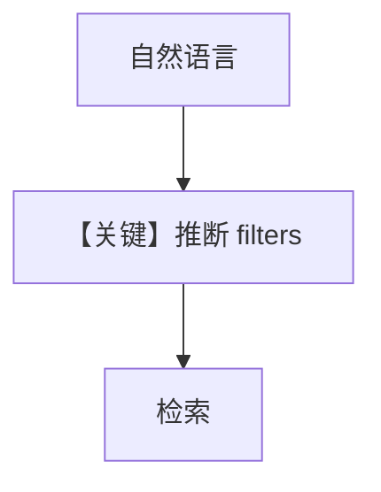

# 03_team_with_agentic_knowledge_filters.py — 实现原理分析

> 源文件：`cookbook/03_teams/05_knowledge/03_team_with_agentic_knowledge_filters.py`

## 概述

**enable_agentic_knowledge_filters=True**（`team.py` L207）：由模型从用户话中推断过滤条件（如 `user_id as jordan_mitchell`），相对 02 的固定 dict 更动态。

**核心配置一览：**

| 配置项 | 值 |
|--------|-----|
| `enable_agentic_knowledge_filters` | `True` |

## Mermaid 流程图

```mermaid
flowchart TD
    U["自然语言"] --> A["【关键】推断 filters"]
    A --> S["检索"]
```

- **【关键】推断 filters**：Agentic 元数据。

## 关键源码文件索引

| 文件 | 作用 |
|------|------|
| `agno/team/team.py` | L207 |
