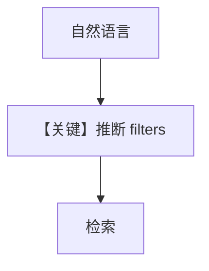

# 03_team_with_agentic_knowledge_filters.py — 实现原理分析

<!-- cookbook-py-source:start -->
## 完整源码

```python
"""
Team With Agentic Knowledge Filters
===================================

Demonstrates AI-driven dynamic knowledge filtering for team retrieval.
"""

from agno.agent import Agent
from agno.knowledge.knowledge import Knowledge
from agno.models.openai import OpenAIResponses
from agno.team import Team
from agno.utils.media import (
    SampleDataFileExtension,
    download_knowledge_filters_sample_data,
)
from agno.vectordb.lancedb import LanceDb

# ---------------------------------------------------------------------------
# Setup
# ---------------------------------------------------------------------------
downloaded_cv_paths = download_knowledge_filters_sample_data(
    num_files=5, file_extension=SampleDataFileExtension.PDF
)

vector_db = LanceDb(
    table_name="recipes",
    uri="tmp/lancedb",
)

knowledge = Knowledge(
    vector_db=vector_db,
)

knowledge.insert_many(
    [
        {
            "path": downloaded_cv_paths[0],
            "metadata": {
                "user_id": "jordan_mitchell",
                "document_type": "cv",
                "year": 2025,
            },
        },
        {
            "path": downloaded_cv_paths[1],
            "metadata": {
                "user_id": "taylor_brooks",
                "document_type": "cv",
                "year": 2025,
            },
        },
        {
            "path": downloaded_cv_paths[2],
            "metadata": {
                "user_id": "morgan_lee",
                "document_type": "cv",
                "year": 2025,
            },
        },
        {
            "path": downloaded_cv_paths[3],
            "metadata": {
                "user_id": "casey_jordan",
                "document_type": "cv",
                "year": 2025,
            },
        },
        {
            "path": downloaded_cv_paths[4],
            "metadata": {
                "user_id": "alex_rivera",
                "document_type": "cv",
                "year": 2025,
            },
        },
    ]
)

# ---------------------------------------------------------------------------
# Create Members
# ---------------------------------------------------------------------------
web_agent = Agent(
    name="Knowledge Search Agent",
    role="Handle knowledge search",
    knowledge=knowledge,
    model=OpenAIResponses(id="gpt-5-mini"),
    instructions=["Always take into account filters"],
)

# ---------------------------------------------------------------------------
# Create Team
# ---------------------------------------------------------------------------
team_with_knowledge = Team(
    name="Team with Knowledge",
    members=[web_agent],
    model=OpenAIResponses(id="gpt-5-mini"),
    knowledge=knowledge,
    show_members_responses=True,
    markdown=True,
    enable_agentic_knowledge_filters=True,
)

# ---------------------------------------------------------------------------
# Run Team
# ---------------------------------------------------------------------------
if __name__ == "__main__":
    team_with_knowledge.print_response(
        "Tell me about Jordan Mitchell's work and experience with user_id as jordan_mitchell"
    )
```

<!-- cookbook-py-source:end -->

> 源文件：`cookbook/03_teams/05_knowledge/03_team_with_agentic_knowledge_filters.py`

## 概述

**enable_agentic_knowledge_filters=True**（`team.py` L207）：由模型从用户话中推断过滤条件（如 `user_id as jordan_mitchell`），相对 02 的固定 dict 更动态。

**核心配置一览：**

| 配置项 | 值 |
|--------|-----|
| `enable_agentic_knowledge_filters` | `True` |

## Mermaid 流程图


```mermaid
flowchart TD
    U["自然语言"] --> A["【关键】推断 filters"]
    A --> S["检索"]
```

- **【关键】推断 filters**：Agentic 元数据。

## 关键源码文件索引

| 文件 | 作用 |
|------|------|
| `agno/team/team.py` | L207 |
