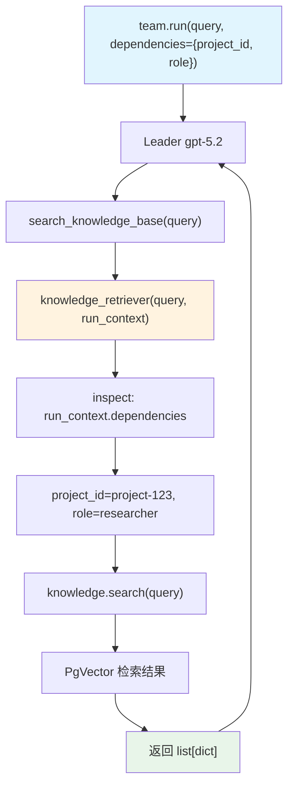

# 04_team_with_custom_retriever.py — 实现原理分析

> 源文件：`cookbook/03_teams/05_knowledge/04_team_with_custom_retriever.py`

## 概述

本示例展示 Agno Team 的 **`knowledge_retriever` 自定义检索函数**：通过传入 `knowledge_retriever=knowledge_retriever` 完全替代默认检索逻辑，自定义函数可访问 `RunContext.dependencies`（运行时依赖注入），根据 `project_id`、`role`、`team_context` 等上下文信息动态调整检索策略。

**核心配置一览：**

| 配置项 | 值 | 说明 |
|--------|------|------|
| `knowledge` | `Knowledge(PgVector)` | PostgreSQL 向量存储 |
| `knowledge_retriever` | `knowledge_retriever` 函数 | 自定义检索逻辑 |
| `search_knowledge` | `True` | 启用知识库搜索工具 |
| `add_knowledge_to_context` | `True` | 检索结果注入上下文 |
| `members` | `[researcher, analyst]` | 研究+分析两名成员 |

## 核心组件解析

### 自定义检索函数签名

```python
def knowledge_retriever(
    query: str,
    team: Optional[Team] = None,
    num_documents: int = 5,
    run_context: Optional[RunContext] = None,
    **kwargs,
) -> Optional[list[dict]]:
```

函数接收查询字符串和运行时上下文，返回文档字典列表。

### `RunContext.dependencies` 依赖注入

```python
team.run(
    "What are AI agents?",
    dependencies={
        "project_id": "project-123",
        "role": "researcher",
        "team_context": {"focus_area": "AI/ML"},
    },
)
```

`dependencies` 在 `run()` 时传入，通过 `run_context.dependencies` 在检索函数中访问，实现多租户检索、权限控制等高级场景。

## Mermaid 流程图



## 关键源码文件索引

| 文件 | 关键函数/类 | 作用 |
|------|------------|------|
| `agno/team/team.py` | `knowledge_retriever` | 自定义检索函数挂载点 |
| `agno/run/context.py` | `RunContext.dependencies` | 运行时依赖注入 |
| `agno/vectordb/pgvector.py` | `PgVector` | PostgreSQL 向量存储 |
