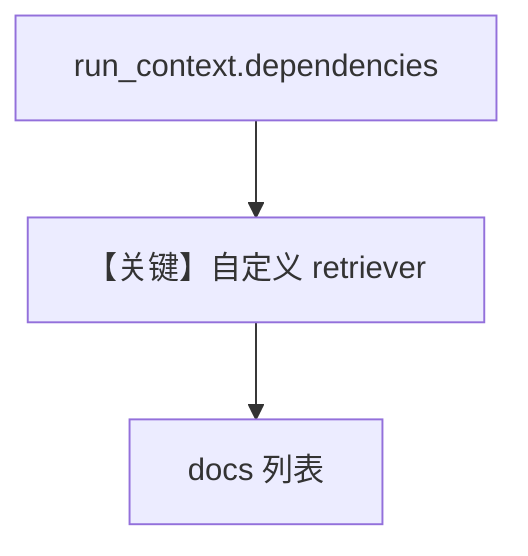

# 04_team_with_custom_retriever.py — 实现原理分析

> 源文件：`cookbook/03_teams/05_knowledge/04_team_with_custom_retriever.py`

## 概述

**knowledge_retriever** 自定义（`team.py` L213–217）：函数签名可收 `team`、`run_context`，示例在 `dependencies` 存在时打印 `project_id`/`role`，再调用 `knowledge.search`；**PgVector** + Postgres。

**核心配置一览：**

| 配置项 | 值 |
|--------|-----|
| `knowledge_retriever` | `knowledge_retriever` 函数 |
| `search_knowledge` | `True` |
| `add_knowledge_to_context` | `True` |

## Mermaid 流程图

```mermaid
flowchart TD
    RC["run_context.dependencies"] --> CR["【关键】自定义 retriever"]
    CR --> D["docs 列表"]
```

- **【关键】自定义 retriever**：可编程检索 + 依赖注入。

## 关键源码文件索引

| 文件 | 作用 |
|------|------|
| `agno/team/team.py` | L213-217 |
