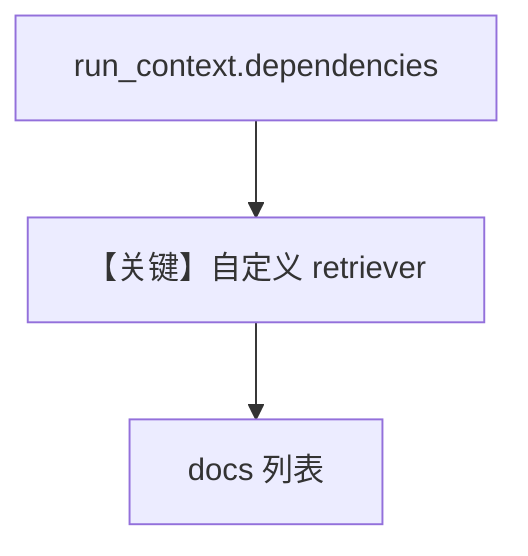

# 04_team_with_custom_retriever.py — 实现原理分析

<!-- cookbook-py-source:start -->
## 完整源码

```python
"""
Team With Custom Retriever
==========================

Demonstrates a custom team knowledge retriever that uses runtime dependencies.
"""

from typing import Optional

from agno.agent import Agent
from agno.knowledge.embedder.openai import OpenAIEmbedder
from agno.knowledge.knowledge import Knowledge
from agno.models.openai import OpenAIResponses
from agno.run import RunContext
from agno.team import Team
from agno.vectordb.pgvector import PgVector

# ---------------------------------------------------------------------------
# Setup
# ---------------------------------------------------------------------------
db_url = "postgresql+psycopg://ai:ai@localhost:5532/ai"
vector_db = PgVector(
    table_name="team-knowledge",
    embedder=OpenAIEmbedder(id="text-embedding-3-small"),
    db_url=db_url,
)
knowledge = Knowledge(vector_db=vector_db)

knowledge.insert(
    url="https://docs.agno.com/llms-full.txt",
)


def knowledge_retriever(
    query: str,
    team: Optional[Team] = None,
    num_documents: int = 5,
    run_context: Optional[RunContext] = None,
    **kwargs,
) -> Optional[list[dict]]:
    """Custom team knowledge retriever that can inspect runtime dependencies."""
    dependencies = run_context.dependencies if run_context else None

    if dependencies:
        print(f"[Team Retriever] Dependencies received: {list(dependencies.keys())}")

        project_id = dependencies.get("project_id")
        user_role = dependencies.get("role")
        team_context = dependencies.get("team_context")

        if project_id:
            print(f"[Team Retriever] Project ID: {project_id}")

        if user_role:
            print(f"[Team Retriever] User role: {user_role}")

        if team_context:
            print(f"[Team Retriever] Team context: {team_context}")
    else:
        print("[Team Retriever] No dependencies available")

    try:
        docs = knowledge.search(
            query=query,
            max_results=num_documents,
        )
        print(f"[Team Retriever] Found {len(docs)} documents")
        return [doc.to_dict() for doc in docs]
    except Exception as e:
        print(f"[Team Retriever] Error: {e}")
        return []


# ---------------------------------------------------------------------------
# Create Members
# ---------------------------------------------------------------------------
researcher = Agent(
    name="Researcher",
    model=OpenAIResponses(id="gpt-5.2"),
    role="Research information from the knowledge base",
)

analyst = Agent(
    name="Analyst",
    model=OpenAIResponses(id="gpt-5.2"),
    role="Analyze and synthesize information",
)

# ---------------------------------------------------------------------------
# Create Team
# ---------------------------------------------------------------------------
research_team = Team(
    name="Research Team",
    model=OpenAIResponses(id="gpt-5.2"),
    members=[researcher, analyst],
    knowledge=knowledge,
    knowledge_retriever=knowledge_retriever,
    search_knowledge=True,
    add_knowledge_to_context=True,
    instructions="Work together to research and analyze information. Always search the knowledge base first using the search_knowledge_base tool before answering.",
)

# ---------------------------------------------------------------------------
# Run Team
# ---------------------------------------------------------------------------
if __name__ == "__main__":
    print("=== Example 1: Team Without Dependencies ===\n")
    response = research_team.run(
        "What are AI agents? Search the knowledge base for information.",
    )
    print(f"\nTeam Response: {response.content}\n")

    print("\n=== Example 2: Team With Runtime Dependencies ===\n")
    response = research_team.run(
        "What are AI agents? Search the knowledge base for information.",
        dependencies={
            "project_id": "project-123",
            "role": "researcher",
            "team_context": {
                "focus_area": "AI/ML",
                "priority": "high",
            },
        },
    )
    print(f"\nTeam Response: {response.content}\n")
```

<!-- cookbook-py-source:end -->

> 源文件：`cookbook/03_teams/05_knowledge/04_team_with_custom_retriever.py`

## 概述

**knowledge_retriever** 自定义（`team.py` L213–217）：函数签名可收 `team`、`run_context`，示例在 `dependencies` 存在时打印 `project_id`/`role`，再调用 `knowledge.search`；**PgVector** + Postgres。

**核心配置一览：**

| 配置项 | 值 |
|--------|-----|
| `knowledge_retriever` | `knowledge_retriever` 函数 |
| `search_knowledge` | `True` |
| `add_knowledge_to_context` | `True` |

## Mermaid 流程图


```mermaid
flowchart TD
    RC["run_context.dependencies"] --> CR["【关键】自定义 retriever"]
    CR --> D["docs 列表"]
```

- **【关键】自定义 retriever**：可编程检索 + 依赖注入。

## 关键源码文件索引

| 文件 | 作用 |
|------|------|
| `agno/team/team.py` | L213-217 |
