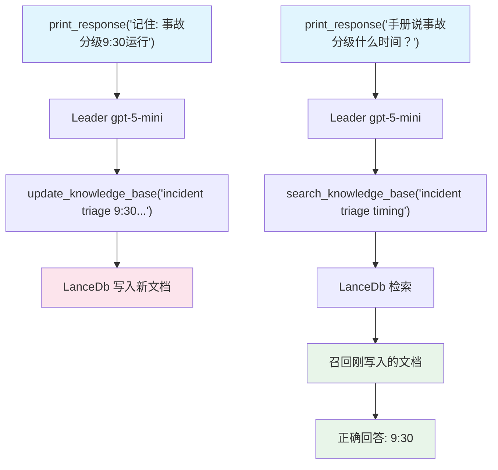

# 05_team_update_knowledge.py — 实现原理分析

> 源文件：`cookbook/03_teams/05_knowledge/05_team_update_knowledge.py`

## 概述

本示例展示 Agno Team 的 **`update_knowledge` 运行时知识写入**：开启后，Team 获得向知识库**写入**新文档的能力（而非只读检索）。用户可以通过自然语言指令（如"记住这个事实"）将信息持久化到向量数据库，后续检索时可直接召回。

**核心配置一览：**

| 配置项 | 值 | 说明 |
|--------|------|------|
| `knowledge` | `team_knowledge`（LanceDb） | 运营手册知识库 |
| `update_knowledge` | `True` | 允许运行时写入知识库 |
| `add_knowledge_to_context` | `True` | 自动将检索结果注入上下文 |
| `members` | `[ops_agent]` | 运营成员 |

## 核心组件解析

### 读写分离的两个工具

| 工具 | 触发条件 | 方向 |
|------|---------|------|
| `search_knowledge_base` | 需要查询已知信息 | 读 |
| `update_knowledge_base` | 需要记住新信息 | 写 |

`update_knowledge=True` 在 Leader 的工具列表中额外添加 `update_knowledge_base` 工具。

### 运行时记忆模式

```
第1次: "记住：事故分级每个工作日9:30运行"
  → Leader 调用 update_knowledge_base("incident triage runs...")
  → 文档写入 LanceDb

第2次: "我们的手册说事故分级时间是？"
  → Leader 调用 search_knowledge_base("incident triage timing")
  → 召回第1次写入的文档
  → 正确回答
```

## Mermaid 流程图



## 关键源码文件索引

| 文件 | 关键函数/类 | 作用 |
|------|------------|------|
| `agno/team/team.py` | `update_knowledge` | 运行时写入开关 |
| `agno/knowledge/knowledge.py` | `Knowledge` | 知识库读写接口 |
