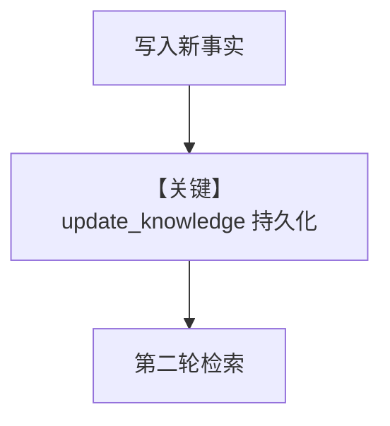

# 05_team_update_knowledge.py — 实现原理分析

<!-- cookbook-py-source:start -->
## 完整源码

```python
"""
Team Update Knowledge
====================

Demonstrates enabling `update_knowledge` so teams can persist new facts.
"""

from agno.agent import Agent
from agno.knowledge.knowledge import Knowledge
from agno.models.openai import OpenAIResponses
from agno.team import Team
from agno.vectordb.lancedb import LanceDb

# ---------------------------------------------------------------------------
# Setup
# ---------------------------------------------------------------------------
team_knowledge = Knowledge(
    vector_db=LanceDb(
        table_name="team_update_knowledge",
        uri="tmp/lancedb",
    ),
)
team_knowledge.insert(
    text_content=(
        "Agno teams can coordinate multiple specialist agents for operational tasks "
        "and can use shared memory utilities to stay aligned."
    )
)


# ---------------------------------------------------------------------------
# Create Members
# ---------------------------------------------------------------------------
ops_agent = Agent(
    name="Operations Team Member",
    model=OpenAIResponses(id="gpt-5-mini"),
    instructions=[
        "Store reliable facts when users ask to remember them.",
        "When asked, retrieve from knowledge first, then answer succinctly.",
    ],
)


# ---------------------------------------------------------------------------
# Create Team
# ---------------------------------------------------------------------------
operations_team = Team(
    name="Knowledge Ops Team",
    model=OpenAIResponses(id="gpt-5-mini"),
    members=[ops_agent],
    knowledge=team_knowledge,
    update_knowledge=True,
    add_knowledge_to_context=True,
    instructions=[
        "You maintain an operations playbook for the team.",
        "Use knowledge tools to remember and recall short business facts.",
    ],
)


# ---------------------------------------------------------------------------
# Run Team
# ---------------------------------------------------------------------------
if __name__ == "__main__":
    operations_team.print_response(
        "Remember: incident triage runs every weekday at 9:30 local time.",
        stream=True,
    )

    operations_team.print_response(
        "What does our playbook say about incident triage timing?",
        stream=True,
    )
```

<!-- cookbook-py-source:end -->

> 源文件：`cookbook/03_teams/05_knowledge/05_team_update_knowledge.py`

## 概述

**update_knowledge=True**（`team.py` L209）+ **add_knowledge_to_context=True**：允许在 run 中向向量库写入新事实并参与检索；两轮对话先「记住」再「回忆」。

**核心配置一览：**

| 配置项 | 值 |
|--------|-----|
| `update_knowledge` | `True` |
| `add_knowledge_to_context` | `True` |

## Mermaid 流程图


```mermaid
flowchart TD
    W["写入新事实"] --> U["【关键】update_knowledge 持久化"]
    U --> R["第二轮检索"]
```

- **【关键】update_knowledge**：团队可更新知识库。

## 关键源码文件索引

| 文件 | 作用 |
|------|------|
| `agno/team/team.py` | L209 |
