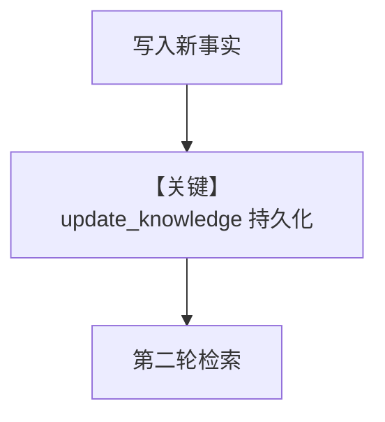

# 05_team_update_knowledge.py — 实现原理分析

> 源文件：`cookbook/03_teams/05_knowledge/05_team_update_knowledge.py`

## 概述

**update_knowledge=True**（`team.py` L209）+ **add_knowledge_to_context=True**：允许在 run 中向向量库写入新事实并参与检索；两轮对话先「记住」再「回忆」。

**核心配置一览：**

| 配置项 | 值 |
|--------|-----|
| `update_knowledge` | `True` |
| `add_knowledge_to_context` | `True` |

## Mermaid 流程图

```mermaid
flowchart TD
    W["写入新事实"] --> U["【关键】update_knowledge 持久化"]
    U --> R["第二轮检索"]
```

- **【关键】update_knowledge**：团队可更新知识库。

## 关键源码文件索引

| 文件 | 作用 |
|------|------|
| `agno/team/team.py` | L209 |
