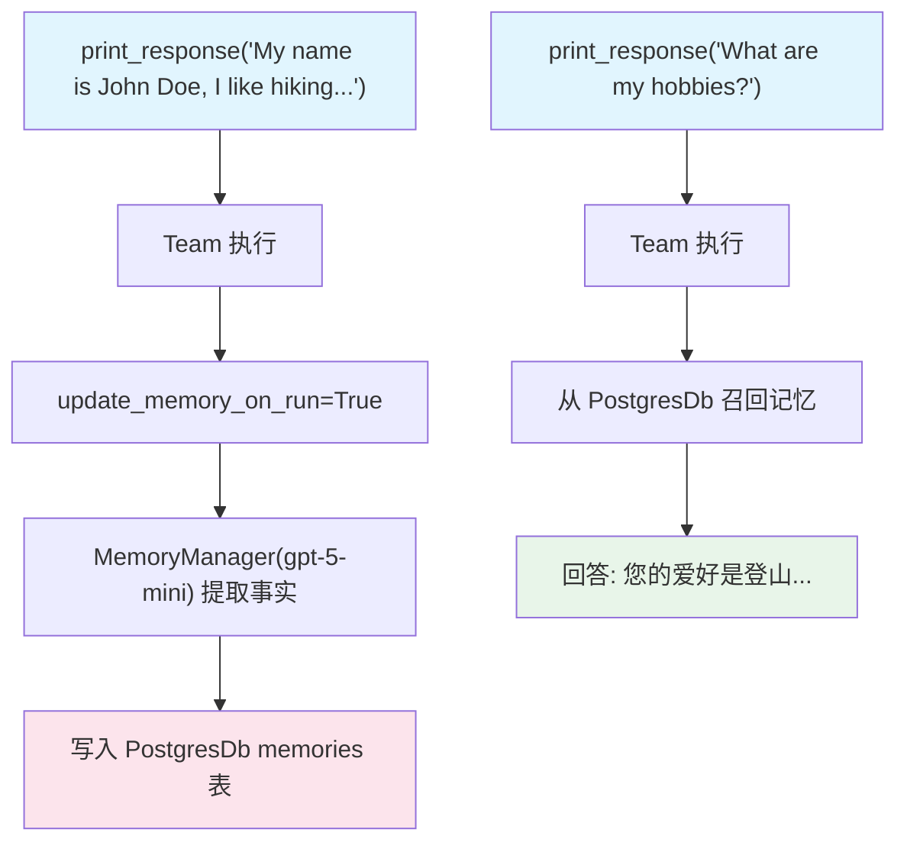

# 01_team_with_memory_manager.py — 实现原理分析

> 源文件：`cookbook/03_teams/06_memory/01_team_with_memory_manager.py`

## 概述

本示例展示 Agno Team 的 **`MemoryManager` 持久化用户记忆**：配置 `memory_manager` + `update_memory_on_run=True`，每次运行后自动提取并持久化用户信息（如姓名、爱好）到 PostgreSQL，后续运行可跨会话召回这些记忆。

**核心配置一览：**

| 配置项 | 值 | 说明 |
|--------|------|------|
| `memory_manager` | `MemoryManager(model=gpt-5-mini)` | 记忆提取模型 |
| `update_memory_on_run` | `True` | 每次运行后更新记忆 |
| `db` | `PostgresDb` | 持久化存储（生产级） |
| `members` | `[agent]` | 普通成员 |

## 核心组件解析

### 记忆更新流程

```python
team.print_response(
    "My name is John Doe and I like to hike in the mountains on weekends.",
    user_id=john_doe_id,
    session_id=session_id,
)
```

1. Team 运行完成后，`MemoryManager` 用 gpt-5-mini 分析对话
2. 提取事实：`{"name": "John Doe", "hobby": "hiking in mountains on weekends"}`
3. 写入 PostgreSQL `memories` 表（按 `user_id` 索引）

### 跨会话记忆召回

```python
team.print_response("What are my hobbies?", user_id=john_doe_id)
# 召回记忆: "User likes to hike in mountains on weekends"
# 回答: "Your hobbies include hiking in the mountains on weekends."
```

### 记忆检索

```python
memories = team.get_user_memories(user_id=john_doe_id)
```

返回该用户的所有持久化记忆列表。

## Mermaid 流程图



## 关键源码文件索引

| 文件 | 关键函数/类 | 作用 |
|------|------------|------|
| `agno/memory/__init__.py` | `MemoryManager` | 记忆提取与管理 |
| `agno/team/team.py` | `memory_manager`, `update_memory_on_run` | 记忆配置 |
| `agno/db/postgres.py` | `PostgresDb` | 生产级持久化存储 |
