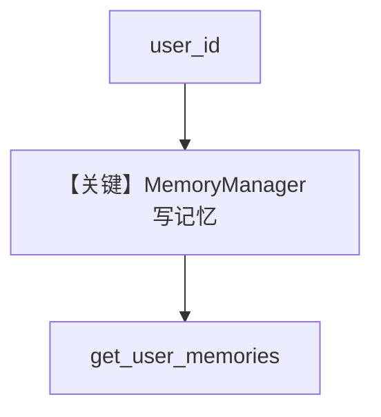

# 01_team_with_memory_manager.py — 实现原理分析

> 源文件：`cookbook/03_teams/06_memory/01_team_with_memory_manager.py`

## 概述

**Team.memory_manager** + **PostgresDb** + **update_memory_on_run=True**：显式 `MemoryManager` 与 `clear()` 演示；`user_id`/`session_id` 固定多轮，`get_user_memories` 打印。

**核心配置一览：**

| 配置项 | 值 |
|--------|-----|
| `memory_manager` | `MemoryManager(model=...)` |
| `update_memory_on_run` | `True` |
| `db` | `PostgresDb` |

## Mermaid 流程图

```mermaid
flowchart TD
    U["user_id"] --> M["【关键】MemoryManager 写记忆"]
    M --> G["get_user_memories"]
```

- **【关键】MemoryManager 写记忆**：持久用户记忆。

## 关键源码文件索引

| 文件 | 作用 |
|------|------|
| `agno/memory/manager.py` | `MemoryManager` |
| `agno/team/team.py` | memory 相关字段 |
