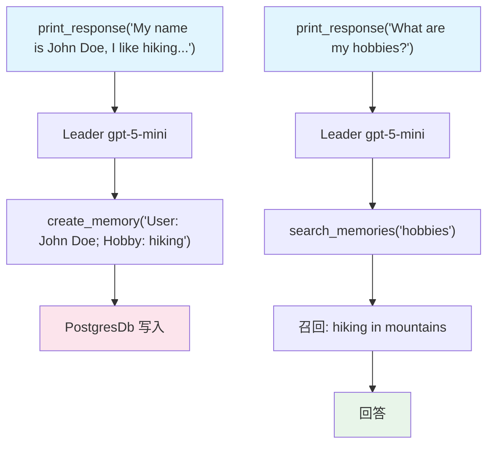

# 02_team_with_agentic_memory.py — 实现原理分析

> 源文件：`cookbook/03_teams/06_memory/02_team_with_agentic_memory.py`

## 概述

本示例展示 Agno Team 的 **`enable_agentic_memory` 自主记忆模式**：与 `MemoryManager`（后台处理）不同，`enable_agentic_memory=True` 让 Team Leader **主动调用记忆工具**（`create_memory`、`update_memory`、`search_memories`）来管理用户记忆，记忆操作作为工具调用可见，更透明可控。

**核心配置一览：**

| 配置项 | 值 | 说明 |
|--------|------|------|
| `enable_agentic_memory` | `True` | Leader 主动调用记忆工具 |
| `db` | `PostgresDb` | 持久化存储 |
| `members` | `[agent]` | 普通成员 |

## 核心组件解析

### Agentic Memory vs MemoryManager

| 特性 | `MemoryManager` | `enable_agentic_memory` |
|------|----------------|------------------------|
| 触发方式 | 自动（运行后后台） | LLM 主动调用工具 |
| 可见性 | 隐式 | 显式（工具调用日志） |
| 控制粒度 | 统一提取 | LLM 自主判断何时记忆 |
| 适用场景 | 自动化记忆 | 需要透明记忆管理 |

### Leader 可用的记忆工具

启用后，Leader 工具列表增加：
- `create_memory(memory: str)` — 创建新记忆
- `update_memory(memory_id: str, memory: str)` — 更新已有记忆
- `search_memories(query: str)` — 搜索用户记忆
- `delete_memory(memory_id: str)` — 删除记忆

Leader 根据对话内容自主决定何时调用这些工具。

## Mermaid 流程图

## 关键源码文件索引

| 文件 | 关键函数/类 | 作用 |
|------|------------|------|
| `agno/team/team.py` | `enable_agentic_memory` | 自主记忆模式开关 |
| `agno/db/postgres.py` | `PostgresDb` | 记忆持久化存储 |
