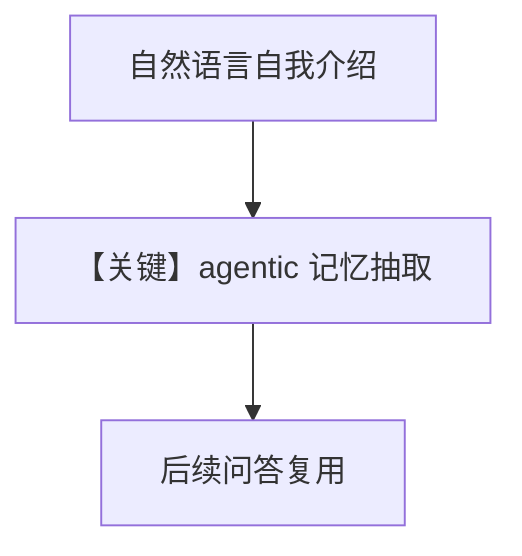

# 02_team_with_agentic_memory.py — 实现原理分析

> 源文件：`cookbook/03_teams/06_memory/02_team_with_agentic_memory.py`

## 概述

**enable_agentic_memory=True**：框架在 run 中自动创建/更新记忆（相对显式 `MemoryManager` 配置更少）；仍用 **PostgresDb**。

**核心配置一览：**

| 配置项 | 值 |
|--------|-----|
| `enable_agentic_memory` | `True` |

## Mermaid 流程图

```mermaid
flowchart TD
    R["自然语言自我介绍"] --> A["【关键】agentic 记忆抽取"]
    A --> Q["后续问答复用"]
```

- **【关键】agentic 记忆抽取**：自动化记忆管线。

## 关键源码文件索引

| 文件 | 作用 |
|------|------|
| `agno/team/team.py` | `enable_agentic_memory` |
