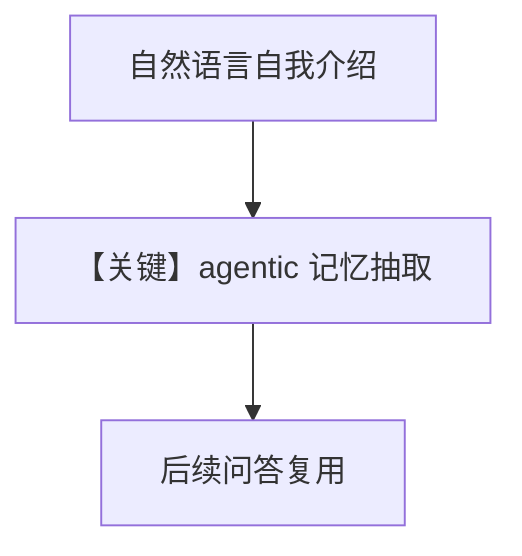

# 02_team_with_agentic_memory.py — 实现原理分析

<!-- cookbook-py-source:start -->
## 完整源码

```python
"""
Team With Agentic Memory
========================

Demonstrates team-level agentic memory creation and updates during runs.
"""

from agno.agent import Agent
from agno.db.postgres import PostgresDb
from agno.models.openai import OpenAIResponses
from agno.team import Team

# ---------------------------------------------------------------------------
# Setup
# ---------------------------------------------------------------------------
db_url = "postgresql+psycopg://ai:ai@localhost:5532/ai"
db = PostgresDb(db_url=db_url)
john_doe_id = "john_doe@example.com"

# ---------------------------------------------------------------------------
# Create Members
# ---------------------------------------------------------------------------
agent = Agent(
    model=OpenAIResponses(id="gpt-5-mini"),
)

# ---------------------------------------------------------------------------
# Create Team
# ---------------------------------------------------------------------------
team = Team(
    model=OpenAIResponses(id="gpt-5-mini"),
    members=[agent],
    db=db,
    enable_agentic_memory=True,
)

# ---------------------------------------------------------------------------
# Run Team
# ---------------------------------------------------------------------------
if __name__ == "__main__":
    team.print_response(
        "My name is John Doe and I like to hike in the mountains on weekends.",
        stream=True,
        user_id=john_doe_id,
    )

    team.print_response("What are my hobbies?", stream=True, user_id=john_doe_id)
```

<!-- cookbook-py-source:end -->

> 源文件：`cookbook/03_teams/06_memory/02_team_with_agentic_memory.py`

## 概述

**enable_agentic_memory=True**：框架在 run 中自动创建/更新记忆（相对显式 `MemoryManager` 配置更少）；仍用 **PostgresDb**。

**核心配置一览：**

| 配置项 | 值 |
|--------|-----|
| `enable_agentic_memory` | `True` |

## Mermaid 流程图


```mermaid
flowchart TD
    R["自然语言自我介绍"] --> A["【关键】agentic 记忆抽取"]
    A --> Q["后续问答复用"]
```

- **【关键】agentic 记忆抽取**：自动化记忆管线。

## 关键源码文件索引

| 文件 | 作用 |
|------|------|
| `agno/team/team.py` | `enable_agentic_memory` |
