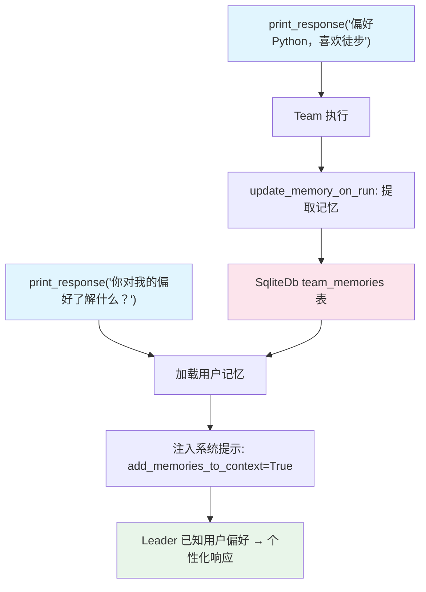

# 03_memories_in_context.py — 实现原理分析

> 源文件：`cookbook/03_teams/06_memory/03_memories_in_context.py`

## 概述

本示例展示 Agno Team 的 **`add_memories_to_context` 记忆注入上下文**：结合 `MemoryManager` 和 `update_memory_on_run=True`，每次运行后自动提取并存储用户偏好，且通过 `add_memories_to_context=True` 将已有记忆**自动注入 Leader 的系统提示**，无需 Leader 主动搜索即可感知用户历史偏好。

**核心配置一览：**

| 配置项 | 值 | 说明 |
|--------|------|------|
| `memory_manager` | `MemoryManager(gpt-5-mini, db=team_db)` | 记忆提取+存储 |
| `update_memory_on_run` | `True` | 每次运行后提取记忆 |
| `add_memories_to_context` | `True` | 记忆注入系统提示 |
| `db` | `SqliteDb`（自定义表名） | SQLite 存储 |

## 核心组件解析

### 与 `enable_agentic_memory` 的关键区别

| 特性 | `enable_agentic_memory` | `add_memories_to_context` |
|------|------------------------|--------------------------|
| 记忆读取方式 | Leader 主动调用 `search_memories` | 自动注入系统提示 |
| 触发条件 | LLM 决策 | 每次运行前自动加载 |
| 适用场景 | 需要选择性召回 | 始终需要用户偏好上下文 |

### 自定义 SQLite 表名

```python
team_db = SqliteDb(
    db_file=db_file,
    session_table="team_sessions",
    memory_table="team_memories",
)
```

`memory_table` 自定义记忆存储表名，避免与其他 Team 的数据混用。

### 系统提示中的记忆格式

注入后，Leader 系统提示中附加：
```
User memories:
- User's preferred coding language is Python
- User likes weekend hikes
```

## Mermaid 流程图



## 关键源码文件索引

| 文件 | 关键函数/类 | 作用 |
|------|------------|------|
| `agno/team/team.py` | `add_memories_to_context` | 记忆自动注入上下文 |
| `agno/db/sqlite.py` | `SqliteDb(session_table, memory_table)` | 自定义表名配置 |
