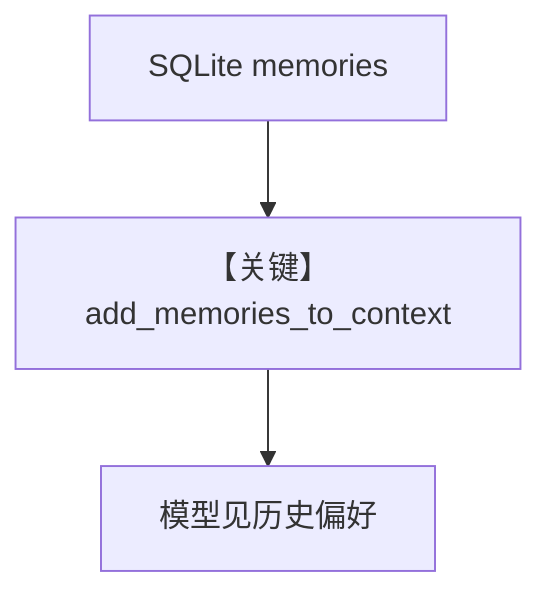

# 03_memories_in_context.py — 实现原理分析

<!-- cookbook-py-source:start -->
## 完整源码

```python
"""
Memories in Context
===================

Demonstrates `add_memories_to_context` with team memory capture.
"""

from pprint import pprint

from agno.agent import Agent
from agno.db.sqlite import SqliteDb
from agno.memory import MemoryManager
from agno.models.openai import OpenAIResponses
from agno.team import Team

# ---------------------------------------------------------------------------
# Setup
# ---------------------------------------------------------------------------
db_file = "tmp/team_memories.db"
team_db = SqliteDb(
    db_file=db_file, session_table="team_sessions", memory_table="team_memories"
)
memory_manager = MemoryManager(
    model=OpenAIResponses(id="gpt-5-mini"),
    db=team_db,
)


# ---------------------------------------------------------------------------
# Create Members
# ---------------------------------------------------------------------------
assistant_agent = Agent(
    name="Personal Assistant",
    model=OpenAIResponses(id="gpt-5-mini"),
    instructions=[
        "Use recent memories to personalize responses.",
        "When unsure, ask for clarification.",
    ],
)


# ---------------------------------------------------------------------------
# Create Team
# ---------------------------------------------------------------------------
personal_team = Team(
    name="Personal Memory Team",
    model=OpenAIResponses(id="gpt-5-mini"),
    members=[assistant_agent],
    db=team_db,
    memory_manager=memory_manager,
    update_memory_on_run=True,
    add_memories_to_context=True,
)


# ---------------------------------------------------------------------------
# Run Team
# ---------------------------------------------------------------------------
if __name__ == "__main__":
    user_id = "jane.doe@example.com"

    personal_team.print_response(
        "My preferred coding language is Python and I like weekend hikes.",
        stream=True,
        user_id=user_id,
    )

    personal_team.print_response(
        "What do you know about my preferences?",
        stream=True,
        user_id=user_id,
    )

    memories = personal_team.get_user_memories(user_id=user_id)
    print("\nCaptured memories:")
    pprint(memories)
```

<!-- cookbook-py-source:end -->

> 源文件：`cookbook/03_teams/06_memory/03_memories_in_context.py`

## 概述

**add_memories_to_context=True**（与 Agent 侧一致）：把用户记忆注入 **system** 上下文；`MemoryManager` 绑定 **SqliteDb** 自定义表名；`update_memory_on_run=True`。

**核心配置一览：**

| 配置项 | 值 |
|--------|-----|
| `add_memories_to_context` | `True` |
| `memory_manager` | 带 `db=team_db` |

## Mermaid 流程图


```mermaid
flowchart TD
    DB["SQLite memories"] --> S["【关键】add_memories_to_context"]
    S --> L["模型见历史偏好"]
```

- **【关键】add_memories_to_context**：记忆进 prompt。

## 关键源码文件索引

| 文件 | 作用 |
|------|------|
| `agno/team/_messages.py` | Team system 中 memories 段（若有） |
| `agno/agent/_messages.py` | 对照 Agent L286+ 记忆段 |
