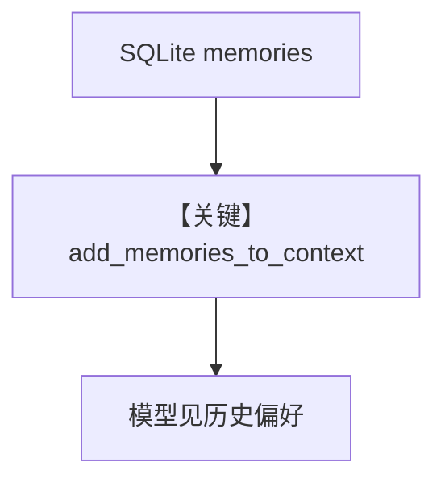

# 03_memories_in_context.py — 实现原理分析

> 源文件：`cookbook/03_teams/06_memory/03_memories_in_context.py`

## 概述

**add_memories_to_context=True**（与 Agent 侧一致）：把用户记忆注入 **system** 上下文；`MemoryManager` 绑定 **SqliteDb** 自定义表名；`update_memory_on_run=True`。

**核心配置一览：**

| 配置项 | 值 |
|--------|-----|
| `add_memories_to_context` | `True` |
| `memory_manager` | 带 `db=team_db` |

## Mermaid 流程图

```mermaid
flowchart TD
    DB["SQLite memories"] --> S["【关键】add_memories_to_context"]
    S --> L["模型见历史偏好"]
```

- **【关键】add_memories_to_context**：记忆进 prompt。

## 关键源码文件索引

| 文件 | 作用 |
|------|------|
| `agno/team/_messages.py` | Team system 中 memories 段（若有） |
| `agno/agent/_messages.py` | 对照 Agent L286+ 记忆段 |
