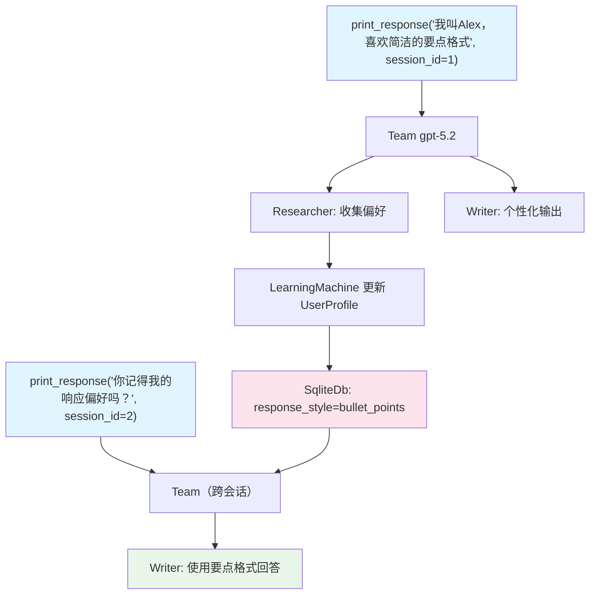

# learning_machine.py — 实现原理分析

> 源文件：`cookbook/03_teams/06_memory/learning_machine.py`

## 概述

本示例展示 Agno Team 的 **`LearningMachine` 用户画像学习**：通过 `learning=LearningMachine(user_profile=UserProfileConfig(mode=LearningMode.AGENTIC))` 让 Team 在多次交互中自动构建和更新用户画像（偏好风格、习惯等），不仅是单条记忆，而是结构化的用户特征模型。

**核心配置一览：**

| 配置项 | 值 | 说明 |
|--------|------|------|
| `learning` | `LearningMachine(user_profile=UserProfileConfig(mode=LearningMode.AGENTIC))` | 自主学习模式 |
| `db` | `SqliteDb(db_file="tmp/teams.db")` | 用户画像持久化 |
| `members` | `[researcher, writer]`（均用 gpt-5.2） | 信息收集+个性化写作 |

## 核心组件解析

### `LearningMachine` vs `MemoryManager`

| 特性 | `MemoryManager` | `LearningMachine` |
|------|----------------|------------------|
| 存储单元 | 独立事实记忆 | 结构化用户画像 |
| 学习粒度 | 事件级 | 用户特征级 |
| 输出 | `list[Memory]` | `UserProfile` 对象 |

### `LearningMode.AGENTIC`

自主模式：Team Leader 在对话中主动识别用户偏好信号（如"我喜欢简洁的回答"），更新 `UserProfile` 中的偏好字段（`response_style`、`detail_level` 等）。

### Researcher + Writer 的协作

- **Researcher**：从用户消息中收集偏好细节
- **Writer**：基于已学习的用户画像，生成个性化响应（如用子弹点，避免冗长）

## Mermaid 流程图

## 关键源码文件索引

| 文件 | 关键函数/类 | 作用 |
|------|------------|------|
| `agno/learn/__init__.py` | `LearningMachine`, `UserProfileConfig`, `LearningMode` | 学习机器配置 |
| `agno/team/team.py` | `learning` | 学习机器挂载点 |
