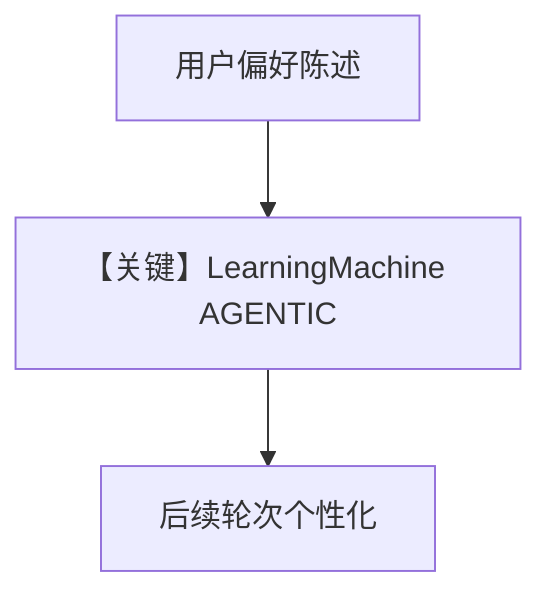

# learning_machine.py — 实现原理分析

> 源文件：`cookbook/03_teams/06_memory/learning_machine.py`

## 概述

**Team.learning=LearningMachine**（`agno/learn`）：`UserProfileConfig(mode=LearningMode.AGENTIC)` 从对话抽取用户画像并复用；双成员 Researcher/Writer；**SqliteDb**。

**核心配置一览：**

| 配置项 | 值 |
|--------|-----|
| `learning` | `LearningMachine(user_profile=UserProfileConfig(...))` |

## Mermaid 流程图

```mermaid
flowchart TD
    I["用户偏好陈述"] --> L["【关键】LearningMachine AGENTIC"]
    L --> P["后续轮次个性化"]
```

- **【关键】LearningMachine AGENTIC**：团队级学习模块。

## 关键源码文件索引

| 文件 | 作用 |
|------|------|
| `agno/learn/` | `LearningMachine` |
