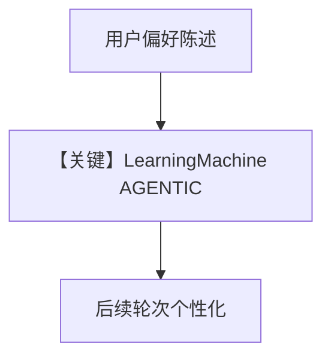

# learning_machine.py — 实现原理分析

<!-- cookbook-py-source:start -->
## 完整源码

```python
"""
Learning Machine
=============================

Demonstrates team learning with LearningMachine and user profile extraction.
"""

from agno.agent import Agent
from agno.db.sqlite import SqliteDb
from agno.learn import LearningMachine, LearningMode, UserProfileConfig
from agno.models.openai import OpenAIResponses
from agno.team import Team

# ---------------------------------------------------------------------------
# Setup
# ---------------------------------------------------------------------------
team_db = SqliteDb(db_file="tmp/teams.db")

# ---------------------------------------------------------------------------
# Create Members
# ---------------------------------------------------------------------------
researcher = Agent(
    name="Researcher",
    model=OpenAIResponses(id="gpt-5.2"),
    role="Collect user preference details and context.",
)

writer = Agent(
    name="Writer",
    model=OpenAIResponses(id="gpt-5.2"),
    role="Write concise recommendations tailored to the user.",
)

# ---------------------------------------------------------------------------
# Create Team
# ---------------------------------------------------------------------------
learning_team = Team(
    name="Learning Team",
    model=OpenAIResponses(id="gpt-5.2"),
    members=[researcher, writer],
    db=team_db,
    learning=LearningMachine(
        user_profile=UserProfileConfig(mode=LearningMode.AGENTIC),
    ),
    markdown=True,
)

# ---------------------------------------------------------------------------
# Run Team
# ---------------------------------------------------------------------------
if __name__ == "__main__":
    user_id = "team-learning-user"

    learning_team.print_response(
        "My name is Alex, and I prefer concise responses with bullet points.",
        user_id=user_id,
        session_id="learning_team_session_1",
        stream=True,
    )

    learning_team.print_response(
        "What do you remember about how I prefer responses?",
        user_id=user_id,
        session_id="learning_team_session_2",
        stream=True,
    )
```

<!-- cookbook-py-source:end -->

> 源文件：`cookbook/03_teams/06_memory/learning_machine.py`

## 概述

**Team.learning=LearningMachine**（`agno/learn`）：`UserProfileConfig(mode=LearningMode.AGENTIC)` 从对话抽取用户画像并复用；双成员 Researcher/Writer；**SqliteDb**。

**核心配置一览：**

| 配置项 | 值 |
|--------|-----|
| `learning` | `LearningMachine(user_profile=UserProfileConfig(...))` |

## Mermaid 流程图


```mermaid
flowchart TD
    I["用户偏好陈述"] --> L["【关键】LearningMachine AGENTIC"]
    L --> P["后续轮次个性化"]
```

- **【关键】LearningMachine AGENTIC**：团队级学习模块。

## 关键源码文件索引

| 文件 | 作用 |
|------|------|
| `agno/learn/` | `LearningMachine` |
