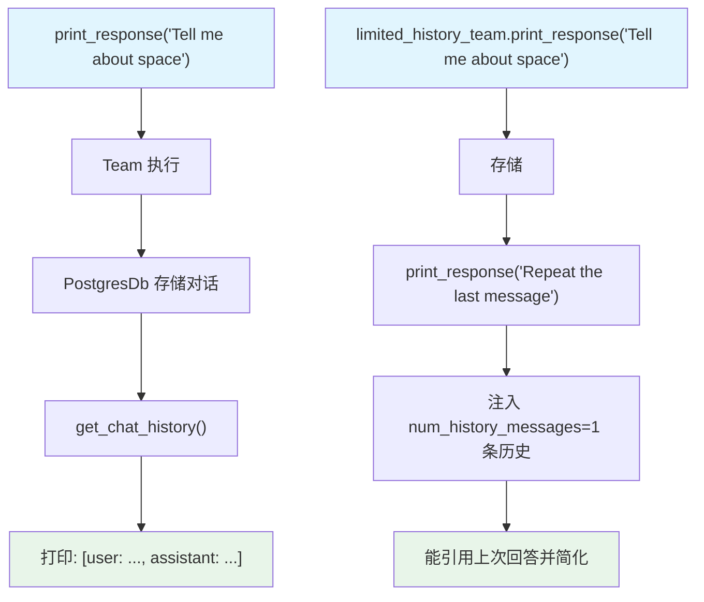

# chat_history.py — 实现原理分析

> 源文件：`cookbook/03_teams/07_session/chat_history.py`

## 概述

本示例展示 Agno Team 的 **聊天历史检索与历史条数限制**：`get_chat_history()` 返回完整对话记录，`num_history_messages=1` 限制注入上下文的历史消息数，在内存效率和上下文连贯性之间取得平衡。

**核心配置一览：**

| 配置项 | 值 | 说明 |
|--------|------|------|
| `history_team` | `db=PostgresDb` | 基础历史存储 |
| `limited_history_team` | `add_history_to_context=True, num_history_messages=1` | 限制历史条数 |

## 核心组件解析

### `get_chat_history()` 返回格式

返回 `list[Message]`，每条消息包含 `role`（"user"/"assistant"/"tool"）和 `content`。

```python
print(history_team.get_chat_history())
# 输出: [Message(role='user', content='...'), Message(role='assistant', content='...')]
```

### `num_history_messages` vs `num_history_runs`

| 参数 | 单位 | 适用场景 |
|------|------|---------|
| `num_history_messages` | 消息条数 | 精确控制 token 用量 |
| `num_history_runs` | 运行次数 | 控制上下文轮次数 |

`num_history_messages=1` 意味着只有最近1条历史消息注入上下文，"Repeat the last message" 任务正好能利用这1条。

## Mermaid 流程图



## 关键源码文件索引

| 文件 | 关键函数/类 | 作用 |
|------|------------|------|
| `agno/team/team.py` | `get_chat_history()`, `num_history_messages` | 历史检索与限制 |
