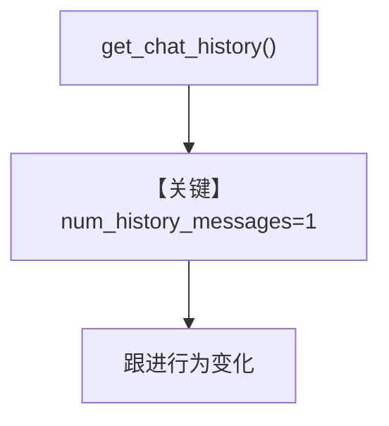

# chat_history.py — 实现原理分析

> 源文件：`cookbook/03_teams/07_session/chat_history.py`

## 概述

**get_chat_history()** 与 **num_history_messages**：`limited_history_team` 设 `add_history_to_context=True` 且 **只取 1 条** 历史消息，演示压缩上下文窗口；`PostgresDb`。

**核心配置一览：**

| 配置项 | 值 |
|--------|-----|
| `num_history_messages` | `1`（limited 团队） |

## Mermaid 流程图

```mermaid
flowchart TD
    H["get_chat_history()"] --> L["【关键】num_history_messages=1"]
    L --> C["跟进行为变化"]
```

- **【关键】num_history_messages=1**：极短历史跟随。

## 关键源码文件索引

| 文件 | 作用 |
|------|------|
| `agno/team/team.py` | 历史条数字段 |
