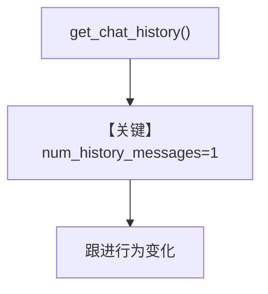

# chat_history.py — 实现原理分析

<!-- cookbook-py-source:start -->
## 完整源码

```python
"""
Chat History
=============================

Demonstrates retrieving chat history and limiting included history messages.
"""

from agno.agent import Agent
from agno.db.postgres import PostgresDb
from agno.models.openai import OpenAIResponses
from agno.team import Team

# ---------------------------------------------------------------------------
# Setup
# ---------------------------------------------------------------------------
db_url = "postgresql+psycopg://ai:ai@localhost:5532/ai"
db = PostgresDb(db_url=db_url, session_table="sessions")

# ---------------------------------------------------------------------------
# Create Members
# ---------------------------------------------------------------------------
agent = Agent(model=OpenAIResponses(id="gpt-5-mini"))

# ---------------------------------------------------------------------------
# Create Team
# ---------------------------------------------------------------------------
history_team = Team(
    model=OpenAIResponses(id="gpt-5-mini"),
    members=[agent],
    db=db,
)

limited_history_team = Team(
    model=OpenAIResponses(id="gpt-5.2"),
    members=[Agent(model=OpenAIResponses(id="gpt-5.2"))],
    db=db,
    add_history_to_context=True,
    num_history_messages=1,
)

# ---------------------------------------------------------------------------
# Run Team
# ---------------------------------------------------------------------------
if __name__ == "__main__":
    history_team.print_response("Tell me a new interesting fact about space")
    print(history_team.get_chat_history())

    history_team.print_response("Tell me a new interesting fact about oceans")
    print(history_team.get_chat_history())

    limited_history_team.print_response("Tell me a new interesting fact about space")
    limited_history_team.print_response(
        "Repeat the last message, but make it much more concise"
    )
```

<!-- cookbook-py-source:end -->

> 源文件：`cookbook/03_teams/07_session/chat_history.py`

## 概述

**get_chat_history()** 与 **num_history_messages**：`limited_history_team` 设 `add_history_to_context=True` 且 **只取 1 条** 历史消息，演示压缩上下文窗口；`PostgresDb`。

**核心配置一览：**

| 配置项 | 值 |
|--------|-----|
| `num_history_messages` | `1`（limited 团队） |

## Mermaid 流程图


```mermaid
flowchart TD
    H["get_chat_history()"] --> L["【关键】num_history_messages=1"]
    L --> C["跟进行为变化"]
```

- **【关键】num_history_messages=1**：极短历史跟随。

## 关键源码文件索引

| 文件 | 作用 |
|------|------|
| `agno/team/team.py` | 历史条数字段 |
