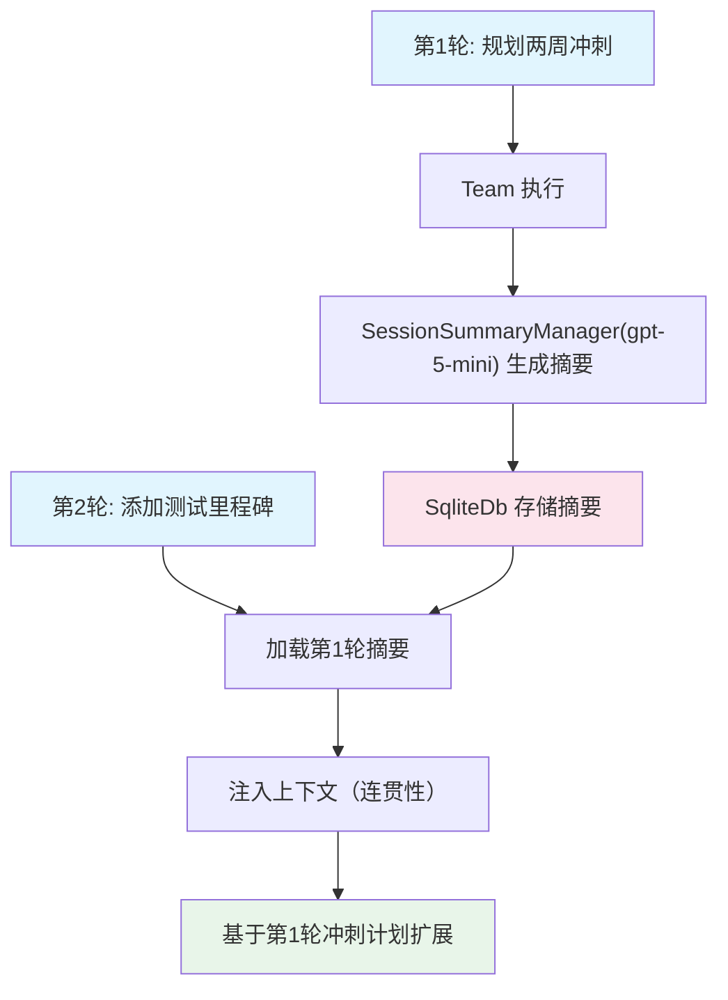

# custom_session_summary.py — 实现原理分析

> 源文件：`cookbook/03_teams/07_session/custom_session_summary.py`

## 概述

本示例展示 Agno Team 的 **`session_summary_manager` 自定义摘要管理器**：通过注入 `SessionSummaryManager` 实例，控制用于生成摘要的模型，并结合 `add_session_summary_to_context=True` 实现跨轮次的上下文连贯性。

**核心配置一览：**

| 配置项 | 值 | 说明 |
|--------|------|------|
| `session_summary_manager` | `SessionSummaryManager(model=gpt-5-mini)` | 自定义摘要生成模型 |
| `add_session_summary_to_context` | `True` | 摘要自动注入后续上下文 |
| `db` | `SqliteDb`（自定义 session_table） | SQLite 存储 |

## 核心组件解析

### `SessionSummaryManager` 的作用

与 `enable_session_summaries=True`（使用默认模型）相比，`session_summary_manager` 允许：
- 指定**专用模型**生成摘要（如用便宜的 gpt-5-mini 摘要，节省成本）
- 未来可扩展自定义摘要格式或后处理逻辑

### 摘要驱动的连贯对话

```python
# 第1轮: 规划冲刺
sprint_team.print_response("Plan a two-week sprint...", session_id=session_id)

# 第2轮: 添加里程碑（摘要注入，知道第1轮说了什么）
sprint_team.print_response("Now add testing milestones...", session_id=session_id)

# 第3轮: 建议下一步（基于整个会话摘要）
sprint_team.print_response("Suggest the most important next action...", session_id=session_id)
```

每轮运行后摘要更新，下一轮通过 `add_session_summary_to_context` 自动获取最新摘要。

## Mermaid 流程图



## 关键源码文件索引

| 文件 | 关键函数/类 | 作用 |
|------|------------|------|
| `agno/session/__init__.py` | `SessionSummaryManager` | 自定义摘要管理器 |
| `agno/team/team.py` | `session_summary_manager`, `get_session_summary()` | 摘要配置和检索 |
