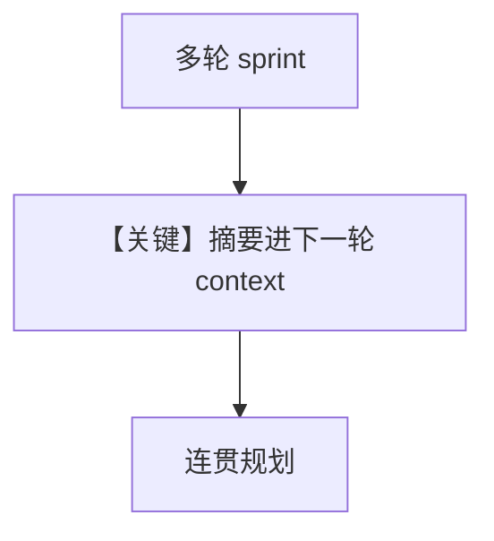

# custom_session_summary.py — 实现原理分析

> 源文件：`cookbook/03_teams/07_session/custom_session_summary.py`

## 概述

**session_summary_manager** + **add_session_summary_to_context=True**：`SessionSummaryManager` 使用轻量模型；固定 `session_id` 多轮规划，`get_session_summary` 读取摘要。

**核心配置一览：**

| 配置项 | 值 |
|--------|-----|
| `session_summary_manager` | `SessionSummaryManager(model=...)` |
| `add_session_summary_to_context` | `True` |

## Mermaid 流程图

```mermaid
flowchart TD
    T["多轮 sprint"] --> S["【关键】摘要进下一轮 context"]
    S --> P["连贯规划"]
```

- **【关键】摘要进下一轮 context**：长会话压缩。

## 关键源码文件索引

| 文件 | 作用 |
|------|------|
| `agno/session/summary.py` | `SessionSummaryManager` |
