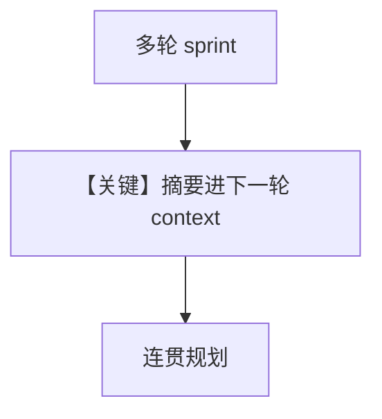

# custom_session_summary.py — 实现原理分析

<!-- cookbook-py-source:start -->
## 完整源码

```python
"""
Custom Session Summary
=====================

Demonstrates configuring a custom session summary manager and reusing summaries in
context.
"""

from agno.agent import Agent
from agno.db.sqlite import SqliteDb
from agno.models.openai import OpenAIResponses
from agno.session import SessionSummaryManager
from agno.team import Team

# ---------------------------------------------------------------------------
# Setup
# ---------------------------------------------------------------------------
db = SqliteDb(
    db_file="tmp/team_session_summary.db",
    session_table="team_summary_sessions",
)
summary_manager = SessionSummaryManager(model=OpenAIResponses(id="gpt-5-mini"))


# ---------------------------------------------------------------------------
# Create Members
# ---------------------------------------------------------------------------
planner = Agent(
    name="Sprint Planner",
    model=OpenAIResponses(id="gpt-5-mini"),
    instructions=[
        "Build concise, sequenced plan summaries.",
        "Keep recommendations practical.",
    ],
)


# ---------------------------------------------------------------------------
# Create Team
# ---------------------------------------------------------------------------
sprint_team = Team(
    name="Sprint Team",
    model=OpenAIResponses(id="gpt-5-mini"),
    members=[planner],
    db=db,
    session_summary_manager=summary_manager,
    add_session_summary_to_context=True,
)


# ---------------------------------------------------------------------------
# Run Team
# ---------------------------------------------------------------------------
if __name__ == "__main__":
    session_id = "sprint-planning-session"

    sprint_team.print_response(
        "Plan a two-week sprint for a small team shipping a documentation portal.",
        stream=True,
        session_id=session_id,
    )

    sprint_team.print_response(
        "Now add testing and rollout milestones to that plan.",
        stream=True,
        session_id=session_id,
    )

    summary = sprint_team.get_session_summary(session_id=session_id)
    if summary is not None:
        print(f"\nSession summary: {summary.summary}")
        if summary.topics:
            print(f"Topics: {', '.join(summary.topics)}")

    sprint_team.print_response(
        "Using what we discussed, suggest the most important next action.",
        stream=True,
        session_id=session_id,
    )
```

<!-- cookbook-py-source:end -->

> 源文件：`cookbook/03_teams/07_session/custom_session_summary.py`

## 概述

**session_summary_manager** + **add_session_summary_to_context=True**：`SessionSummaryManager` 使用轻量模型；固定 `session_id` 多轮规划，`get_session_summary` 读取摘要。

**核心配置一览：**

| 配置项 | 值 |
|--------|-----|
| `session_summary_manager` | `SessionSummaryManager(model=...)` |
| `add_session_summary_to_context` | `True` |

## Mermaid 流程图


```mermaid
flowchart TD
    T["多轮 sprint"] --> S["【关键】摘要进下一轮 context"]
    S --> P["连贯规划"]
```

- **【关键】摘要进下一轮 context**：长会话压缩。

## 关键源码文件索引

| 文件 | 作用 |
|------|------|
| `agno/session/summary.py` | `SessionSummaryManager` |
