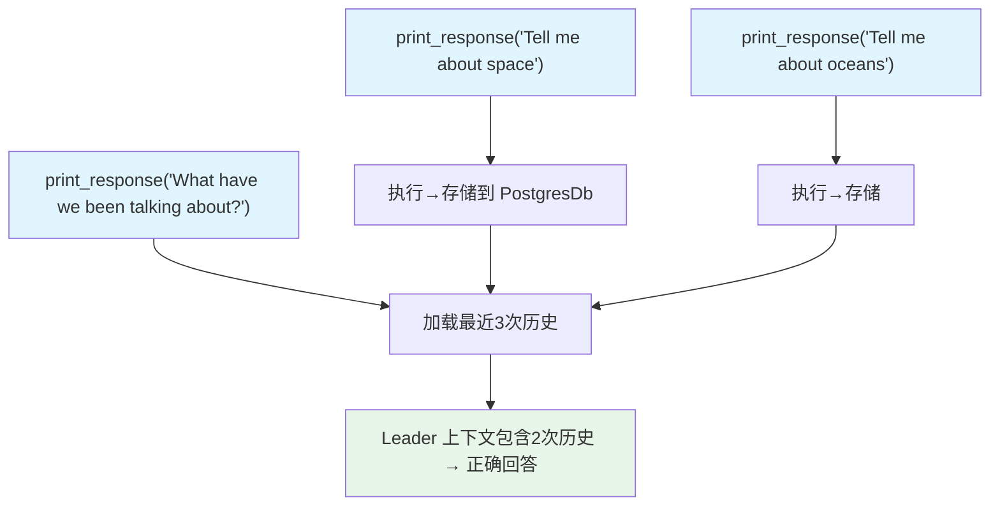

# persistent_session.py — 实现原理分析

> 源文件：`cookbook/03_teams/07_session/persistent_session.py`

## 概述

本示例展示 Agno Team 的 **基础持久化会话**：通过 `PostgresDb` 存储对话历史，`add_history_to_context=True` + `num_history_runs=3` 让 Leader 能引用最近3次运行的对话内容，实现多轮连贯对话。

**核心配置一览：**

| Team | `add_history_to_context` | `num_history_runs` | 说明 |
|------|--------------------------|-------------------|------|
| `basic_team` | 默认（False） | - | 无历史注入 |
| `history_team` | `True` | `3` | 最近3次运行历史注入 |

## 核心组件解析

### `add_history_to_context=True` 的效果

启用后，每次运行前，框架从 `PostgresDb` 读取最近 `num_history_runs` 次的对话消息，附加到 Leader 的上下文中：

```
系统提示:
[当前指令...]

Previous conversations:
<history>
User: Tell me a new interesting fact about space
Assistant: The largest known star is UY Scuti...
</history>

<history>
User: Tell me about oceans
Assistant: The Mariana Trench is...
</history>
```

第3次调用"What have we been talking about?"时，Leader 能正确回答"我们讨论了太空和海洋"。

### `num_history_runs` 的 token 考量

每增加1个历史运行，上下文中增加约2-4条消息（user + assistant + tool calls）。设置过大会增加 token 消耗，需要权衡成本与上下文连贯性。

## Mermaid 流程图



## 关键源码文件索引

| 文件 | 关键函数/类 | 作用 |
|------|------------|------|
| `agno/team/team.py` | `add_history_to_context`, `num_history_runs` | 历史注入配置 |
| `agno/db/postgres.py` | `PostgresDb` | 生产级会话持久化 |
