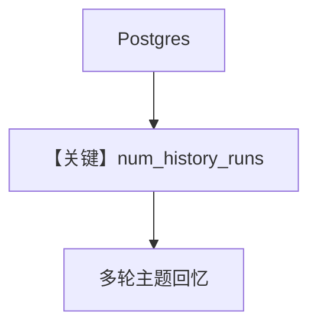

# persistent_session.py — 实现原理分析

> 源文件：`cookbook/03_teams/07_session/persistent_session.py`

## 概述

**PostgresDb** 持久化；`history_team` 使用 **num_history_runs=3** 与 `add_history_to_context=True`，第三轮问「我们聊过什么」依赖前两轮。

**核心配置一览：**

| 配置项 | 值 |
|--------|-----|
| `num_history_runs` | `3` |

## Mermaid 流程图

```mermaid
flowchart TD
    DB["Postgres"] --> R["【关键】num_history_runs"]
    R --> M["多轮主题回忆"]
```

- **【关键】num_history_runs**：按 run 粒度历史。

## 关键源码文件索引

| 文件 | 作用 |
|------|------|
| `agno/team/team.py` | `num_history_runs` |
