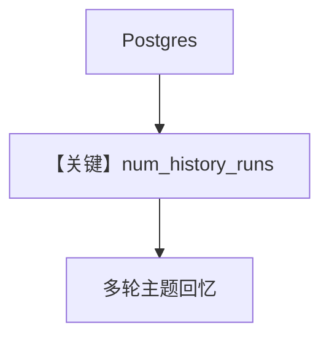

# persistent_session.py — 实现原理分析

<!-- cookbook-py-source:start -->
## 完整源码

```python
"""
Persistent Session
==================

Demonstrates persistent team sessions with optional history injection.
"""

from agno.agent import Agent
from agno.db.postgres import PostgresDb
from agno.models.openai import OpenAIResponses
from agno.team import Team

# ---------------------------------------------------------------------------
# Setup
# ---------------------------------------------------------------------------
db_url = "postgresql+psycopg://ai:ai@localhost:5532/ai"
db = PostgresDb(db_url=db_url, session_table="sessions")

# ---------------------------------------------------------------------------
# Create Members
# ---------------------------------------------------------------------------
agent = Agent(model=OpenAIResponses(id="gpt-5-mini"))

# ---------------------------------------------------------------------------
# Create Team
# ---------------------------------------------------------------------------
basic_team = Team(
    model=OpenAIResponses(id="gpt-5-mini"),
    members=[agent],
    db=db,
)

history_team = Team(
    model=OpenAIResponses(id="gpt-5-mini"),
    members=[agent],
    db=db,
    add_history_to_context=True,
    num_history_runs=3,
)

# ---------------------------------------------------------------------------
# Run Team
# ---------------------------------------------------------------------------
if __name__ == "__main__":
    basic_team.print_response("Tell me a new interesting fact about space")

    history_team.print_response("Tell me a new interesting fact about space")
    history_team.print_response("Tell me a new interesting fact about oceans")
    history_team.print_response("What have we been talking about?")
```

<!-- cookbook-py-source:end -->

> 源文件：`cookbook/03_teams/07_session/persistent_session.py`

## 概述

**PostgresDb** 持久化；`history_team` 使用 **num_history_runs=3** 与 `add_history_to_context=True`，第三轮问「我们聊过什么」依赖前两轮。

**核心配置一览：**

| 配置项 | 值 |
|--------|-----|
| `num_history_runs` | `3` |

## Mermaid 流程图


```mermaid
flowchart TD
    DB["Postgres"] --> R["【关键】num_history_runs"]
    R --> M["多轮主题回忆"]
```

- **【关键】num_history_runs**：按 run 粒度历史。

## 关键源码文件索引

| 文件 | 作用 |
|------|------|
| `agno/team/team.py` | `num_history_runs` |
