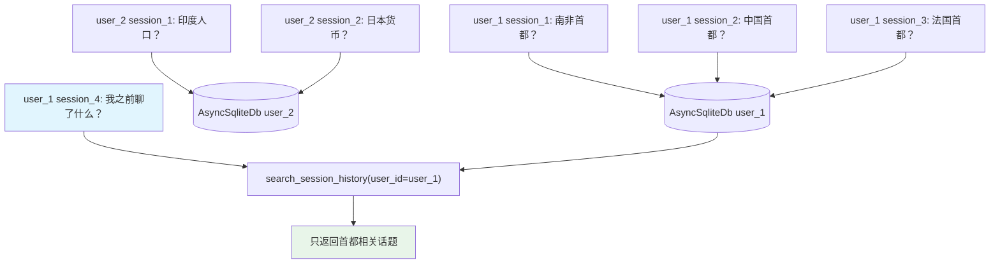

# search_session_history.py — 实现原理分析

> 源文件：`cookbook/03_teams/07_session/search_session_history.py`

## 概述

本示例展示 Agno Team 的 **`search_session_history` 跨会话历史搜索**：Team 可以在用户的多个历史会话中搜索相关信息，且严格按 `user_id` 隔离，用户A无法看到用户B的历史。`num_history_sessions=2` 控制最多向前查找2个历史会话。

**核心配置一览：**

| 配置项 | 值 | 说明 |
|--------|------|------|
| `search_session_history` | `True` | 启用跨会话搜索 |
| `num_history_sessions` | `2` | 最多查询前2个历史会话 |
| `db` | `AsyncSqliteDb` | 异步 SQLite |
| `members` | `[]` | 无成员（Leader 独立响应） |

## 核心组件解析

### 跨会话搜索的隔离保证

```python
# user_1 有 session_1、session_2、session_3（询问首都）
# user_2 有 session_1、session_2（询问人口/货币）

# user_1 查询历史 → 只看到首都话题
# user_2 查询历史 → 只看到人口/货币话题
```

框架在 `search_session_history` 时自动附加 `WHERE user_id = ?` 过滤，确保多用户数据隔离。

### `num_history_sessions` 的限制

`num_history_sessions=2` 表示最多往回看2个会话，避免 token 超限，也防止过旧上下文干扰当前对话。

### `members=[]` 的用法

Team 可以没有成员，Leader 直接用自身模型响应用户。此时 Team 更像一个功能增强版的单 Agent（带会话管理、历史搜索等能力）。

## Mermaid 流程图



## 关键源码文件索引

| 文件 | 关键函数/类 | 作用 |
|------|------------|------|
| `agno/team/team.py` | `search_session_history`, `num_history_sessions` | 跨会话搜索配置 |
| `agno/db/sqlite.py` | `AsyncSqliteDb` | 异步 SQLite 存储 |
