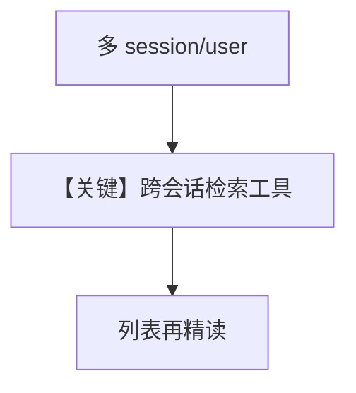

# search_session_history.py — 实现原理分析

<!-- cookbook-py-source:start -->
## 完整源码

```python
"""
Search Session History (Team)
=============================

Demonstrates the two-step list-then-read pattern for accessing previous
team sessions with user-scoped history access.

The team gets two tools:
  - search_past_sessions() -- lightweight per-run previews of recent sessions
  - read_past_session(session_id) -- full conversation for a specific session

Enable with `search_past_sessions=True`. Optionally set
`num_past_sessions_to_search` to control how many past sessions are searched (default 20)
and `num_past_session_runs_in_search` to control how many runs per session appear in
the preview (default 3).
"""

import asyncio
import os

from agno.db.sqlite import AsyncSqliteDb
from agno.models.openai import OpenAIResponses
from agno.team import Team

# ---------------------------------------------------------------------------
# Setup -- fresh DB each run
# ---------------------------------------------------------------------------
DB_FILE = "tmp/team_session_history.db"
if os.path.exists(DB_FILE):
    os.remove(DB_FILE)

db = AsyncSqliteDb(db_file=DB_FILE)

# ---------------------------------------------------------------------------
# Create Team
# ---------------------------------------------------------------------------
team = Team(
    model=OpenAIResponses(id="gpt-4o"),
    members=[],
    db=db,
    search_past_sessions=True,
    num_past_sessions_to_search=10,
)


# ---------------------------------------------------------------------------
# Run
# ---------------------------------------------------------------------------
async def main() -> None:
    # --- User 1 sessions ---
    print("=== User 1 Sessions ===")
    await team.aprint_response(
        "What is the capital of South Africa?",
        session_id="user1_session_1",
        user_id="user_1",
    )
    await team.aprint_response(
        "What is the capital of China?",
        session_id="user1_session_2",
        user_id="user_1",
    )
    await team.aprint_response(
        "What is the capital of France?",
        session_id="user1_session_3",
        user_id="user_1",
    )

    # --- User 2 sessions ---
    print("\n=== User 2 Sessions ===")
    await team.aprint_response(
        "What is the population of India?",
        session_id="user2_session_1",
        user_id="user_2",
    )
    await team.aprint_response(
        "What is the currency of Japan?",
        session_id="user2_session_2",
        user_id="user_2",
    )

    # --- Search: User 1 should only see their own sessions ---
    print("\n=== User 1: Browse all past sessions ===")
    await team.aprint_response(
        "What did I discuss in my previous conversations?",
        session_id="user1_session_4",
        user_id="user_1",
    )

    # --- Search: User 2 should only see their own sessions ---
    print("\n=== User 2: Browse all past sessions ===")
    await team.aprint_response(
        "What did I discuss in my previous conversations?",
        session_id="user2_session_3",
        user_id="user_2",
    )

    # --- Read a specific session ---
    print("\n=== User 1: Read session about China ===")
    await team.aprint_response(
        "Read the full conversation from the session where we discussed China",
        session_id="user1_session_5",
        user_id="user_1",
    )


if __name__ == "__main__":
    asyncio.run(main())
```

<!-- cookbook-py-source:end -->

> 源文件：`cookbook/03_teams/07_session/search_session_history.py`

## 概述

**search_past_sessions=True**（`team.py` L135–140）：队长获得 **search_past_sessions / read_past_session** 类工具；**AsyncSqliteDb** + `aprint_response`；`num_past_sessions_to_search=10`。

**核心配置一览：**

| 配置项 | 值 |
|--------|-----|
| `search_past_sessions` | `True` |
| `members` | `[]`（空成员，纯队长工具） |

## Mermaid 流程图


```mermaid
flowchart TD
    U["多 session/user"] --> S["【关键】跨会话检索工具"]
    S --> P["列表再精读"]
```

- **【关键】跨会话检索工具**：用户级历史可见性。

## 关键源码文件索引

| 文件 | 作用 |
|------|------|
| `agno/team/team.py` | L135-140 |
